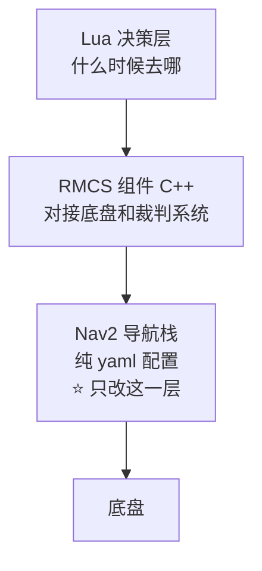

# 导航方向 · 任务规划与教学指南

> 这份文档是**给你自己用的**：告诉你每一步怎么做、为什么这么做、踩到坑怎么办。
> 结论汇总见 [导航提交作业.md](导航提交作业.md)；实测数据见 [实验记录.md](实验记录.md)。

---

## 一、先搞懂这四件事（动手之前）

### 1.1 三层结构，你只改最下面那层



| 层 | 语言 | 干嘛的 | 要改吗 |
|---|---|---|---|
| Lua 决策（`src/lua/`） | Lua | 决定"现在去哪"（巡逻、跨场、回防） | ❌ |
| RMCS 组件（`src/cxx/`） | C++ | 把导航和底盘接起来 | ❌ |
| **Nav2 配置（`config/`）** | **yaml** | **规划路径、跟踪路径** | ✅ **只改这里** |

**说人话**：你这次的任务，**全部工作量就是改几行 yaml + 调一堆数字**。别去碰 C++ 源码，
那是给自己挖坑（任务是"换规划器 + 调参"，不是"写算法"）。

### 1.2 全局 vs 局部，你要换的是左边那个

| | 全局规划器 | 局部规划器（MPPI） |
|---|---|---|
| 多久跑一次 | **1 秒**（行为树锁死） | **每 0.05 秒**（20 Hz） |
| 干嘛的 | 看整张地图，规划"大概怎么走" | 看眼前，实际避障 + 跟踪 |
| 视野 | 整张场地（29.2 × 16.1 m） | 眼前 16 × 16 m |
| 输出 | 一条路径 | 速度指令 |
| 要改吗 | ✅ **就是它** | ❌ 已为全向底盘调好 |

**打个比方**：全局规划器 = 出门前看导航定路线；局部规划器 = 开车时打方向盘躲障碍。

> ⚠️ 搞混这两个，后面全错。你要换的是"看导航定路线的那个"。

### 1.3 "地图"有两个意思，别混

| 种类 | 在哪 | 长什么样 | 给谁用 |
|---|---|---|---|
| **① Nav2 栅格地图** | `maps/*.png` + `*.yaml` | 图片（黑=障碍，白=能走） | **规划器** ← 和你相关 |
| ② Lua 路径点模型 | `src/lua/map/*.lua` | **代码** | 决策层（去哪） |

> `train.lua` 是第 ② 类，**是代码不是图片**，和你调参没关系。

**① 里有哪些地图**（默认用 `rmuc-v2.png`）：

| 文件 | 尺寸 | 分辨率 | 覆盖 |
|---|---|---|---|
| `rmuc.yaml` → **`rmuc-v2.png`** | 292×161 | 0.1 m/格 | 29.2 × 16.1 m ✅ 默认 |
| `rmuc-v3.png` | 292×161 | — | 孤儿（v2 的微调版，没人引用） |
| `rmuc.png` | 292×161 | — | 孤儿（最老版本，缺中部四个六边形障碍） |
| `rmul.yaml` → `rmul.png` | 240×160 | 0.05 m/格 | 12 × 8 m |
| `战队.yaml` → `战队.png` | 343×110 | 0.1 m/格 | 实扫风格（带噪点） |
| `empty.yaml` → `empty.png` | 2000×2000 | 0.05 m/格 | 空图，局部地图 mock 用 |

**换地图不用改文件**，启动时给参数就行：

```bash
ros2 launch rmcs-navigation static.launch.yaml global_map:=战队
```

### 1.4 你要交什么

| 交付物 | 内容 | 放哪 |
|---|---|---|
| 代码改动 | `motion.yaml`（换规划器 + 调参） | 你自己 fork 的 `rmcs-navigation` |
| 提交报告 | 为什么选它 / 差异 / 调参思路 | 本仓库 `导航提交作业.md` |
| 演示 | 基线 vs 新规划器的对比录屏 | 本仓库 `assets/` |

---

## 二、环境与启动

### 2.1 目录地图：我在哪、改哪个

```
/workspaces/RMCS/                      ← 容器内唯一项目目录（容器名 LIGEON）
│
├─ docs/zh-cn/算法组考核/               ★ 本文件夹（你写文档的地方）
│
├─ rmcs_ws/                            ROS2 工作空间
│   ├─ build/ install/ log/            编译产物（别手动改）
│   └─ src/
│       ├─ rmcs_core/ rmcs_bringup/ …  官方框架（别动）
│       └─ rmcs-navigation-deps/       导航依赖栈（第三方）
│           ├─ rmcs-navigation/        ★★★ 你的主战场
│           │   ├─ config/motion.yaml      ★ 你改的参数在这
│           │   ├─ config/motion.xml       行为树（重规划频率）
│           │   ├─ launch/static.launch.yaml  ★ 实验台
│           │   ├─ maps/                   场地地图
│           │   └─ src/                    ❌ 不要动
│           ├─ rmcs-local-map/         局部地图（不动）
│           ├─ rmcs-localization/      定位（不动）
│           ├─ point-lio/              里程计（不动）
│           └─ livox-ros-driver2/ 等   雷达驱动（不动）
│
└─ rmcs_motor_demo/ navigation_ws/ …   往期作业
```

### 2.2 命令速览：其实很简单

先看结论——**日常只有两条命令**：

```bash
# 启动导航栈（在任意目录敲都行）
ros2 launch rmcs-navigation static.launch.yaml

# 调参：直接改 yaml，然后重启上面的命令。不用编译！
vim /workspaces/RMCS/rmcs_ws/src/rmcs-navigation-deps/rmcs-navigation/config/motion.yaml
```

**为什么这么简单？** 因为环境早就配好了：

| 你可能以为要做的事 | 实际 |
|---|---|
| `source /opt/ros/jazzy/setup.bash` | ❌ 不用。`.zshrc` 第 107 行 `source ~/env_setup.zsh` 已自动做掉 |
| `source install/setup.bash` | ❌ 不用。`env_setup.zsh` 里已 source 工作区的 `local_setup.zsh` |
| `export PATH=/opt/cmake/bin:$PATH` | ⚠️ **只在编译时**需要（见下） |
| 改 yaml 后要 `colcon build` | ❌ **不用！** 见 §2.3 |

**验证环境已就绪**（顺手确认一下）：

```bash
ros2 pkg prefix rmcs-navigation
# 期望输出：/workspaces/RMCS/rmcs_ws/install/rmcs-navigation
# 能输出就说明环境全好了，啥都不用 source
```

> **为什么之前文档里那些命令那么长？** 因为踩过一个坑：zsh 下执行
> `source /opt/ros/jazzy/setup.bash` 会**静默失效**（该脚本用 `BASH_SOURCE[0]` 定位自己，
> zsh 里这个变量是空的，于是它跑到当前目录找 `setup.sh`，报
> `no such file: .../rmcs_ws/setup.sh`）。
> **但根本不需要 source 它** —— `.zshrc` 里已经用 `.zsh` 版本配好了。

### 2.3 什么时候才需要编译？

**改配置不用编译！** 因为编译时用了 `--symlink-install`，
`install/` 里的配置是**指向源文件的符号链接**：

```
install/rmcs-navigation/share/rmcs-navigation/config/motion.yaml
   └─ 软链到 → src/.../rmcs-navigation/config/motion.yaml
```

所以改了源文件，`install/` 里**立刻就是新的**（其实是同一个文件）。

| 你改了什么 | 要编译吗 | 要做什么 |
|---|---|---|
| `config/motion.yaml`（**调参主要在这**） | ❌ 不用 | 改完**重启 launch** 即可 |
| `config/motion.xml`（行为树） | ❌ 不用 | 同上 |
| `launch/*.yaml` | ❌ 不用 | 同上 |
| `maps/*.png`、`*.yaml` | ❌ 不用 | 同上（换地图也可用启动参数，见 §2.5） |
| `src/cxx/**`（C++ 源码） | ✅ 要 | 但**本任务不改源码** |

> ⚠️ **前提是编译时带了 `--symlink-install`**。所以首次构建务必加上这个参数（见下）。

**首次搭建才需要编译一次**（一次性，之后基本用不上）：

```bash
cd /workspaces/RMCS/rmcs_ws
PATH=/opt/cmake/bin:$PATH colcon build --packages-up-to rmcs-navigation --symlink-install
```

| 要点 | 说明 |
|---|---|
| `PATH=/opt/cmake/bin:$PATH` | **必须**。`rmcs-navigation` 的 `CMakeLists.txt` 要求 CMake ≥ 3.30，系统自带是 3.28（会报 `CMake 3.30 or higher is required`）；`/opt/cmake/bin/cmake` 是 4.2.3 |
| `--symlink-install` | **必须**。有了它改配置才不用重编译 |
| `--packages-up-to` | 首次要带上（连依赖一起建）；依赖建好后日常用 `--packages-select` 就够 |
| 别用 `build-rmcs` | 它默认 `--merge-install`，与现有 isolated 布局冲突，报 `install directory was created with the layout 'isolated'` |

> 注：`PATH=... cmd` 这种写法在 zsh 里可以直接用，无需 `bash -lc` 或 `export`。

### 2.4 实验台：不需要机器人就能跑

`rmcs-navigation` 自带 `launch/static.launch.yaml`，专为**纯软件联调**设计——
**不用 C 板、不用雷达、不用定位**，就能把整个 Nav2 链路撑起来。

```bash
ros2 launch rmcs-navigation static.launch.yaml
```

**它是怎么做到的？** 用两招"假装"：

| 假装的东西 | 用什么装 | 效果 |
|---|---|---|
| 局部地图 | `map_server` 加载 `empty.yaml`（全空的图） | 局部代价地图永远是空的（没有障碍） |
| 机器人位置 | 两个**静态 TF**：`world→odom`、`odom→base_link` | 机器人永远"停在"原点 |

它会启动的东西：
- `global_map`（真地图 `rmuc-v2.png`）+ `local_map`（假空图）
- `bt_navigator` / `planner_server` / `controller_server`（导航三兄弟）
- `foxglove_bridge`（给你看数据的接口）
- 两个静态 TF

**不会启动**：传感器驱动、SLAM、定位、`rmcs_local_map`、`point_lio`。

启动成功的标志：`foxglove_bridge` 打印 `Server listening on port 8765`。

### 2.5 换地图

不用改文件，启动时给参数即可：

```bash
ros2 launch rmcs-navigation static.launch.yaml global_map:=战队
```

### 2.6 ⚠️ 每次实验前必做：清理残留进程

导航进程**极易遗留**（`AGENTS.md` 专门警告过，称它们容易变僵尸进程）。
不清的话会出现两个症状：

1. **节点重复实例**（`ros2 node list` 里每个节点出现两次）
2. **端口被占**（`foxglove_bridge` 报 `Bind Error`）

```bash
pkill -f 'ros2 launch rmcs-navigation'; sleep 2
for p in nav2_lifecycle_manager nav2_bt_navigator nav2_planner nav2_controller \
         nav2_map_server foxglove_bridge static_transform_publisher; do
  pkill -f "$p"
done
sleep 2
ps aux | grep -E 'nav2|ros2 launch|foxglove' | grep -v grep | wc -l   # 应该输出 0
```

**养成习惯**：每次开实验前先跑一遍，确认是 0 再启动。

---

## 三、★ 怎么看到"动态过程"（Foxglove 观测教学）

这一节是重点：**光有数据不够，你得亲眼看到车怎么走、路径怎么变。**

### 3.1 先解决一个问题：静态环境里车不会动

前面说过，`static.launch.yaml` 的 `odom→base_link` 是**静态 TF**，
所以机器人**永远停在原点**。后果：

| ✅ 能看到 | ❌ 看不到 |
|---|---|
| 路径被规划出来（`/plan`，1 Hz 刷新） | 机器人**移动** |
| 全局代价地图（固定不动） | 局部代价地图**滚动** |
| `/cmd_vel` 被算出来 | MPPI **跟踪**效果 |

**要让画面动起来，必须让 `base_link` 动。** 两种办法：

| 办法 | 做法 | 成本 |
|---|---|---|
| **轻量（推荐）** | 杀掉静态 TF，用 `tools/virtual_chassis.py` 积分 `/cmd_vel` 发布动态 TF | 零依赖，秒级启动 |
| 重量 | 上 Gazebo 仿真 | 要装仿真包、建模型、配插件，工作量大 |
| 最终 | 实车 | 需要硬件 |

> **虚拟底盘是什么**：一个小程序，订阅 `/cmd_vel`（局部控制器给的指令），
> 按质点运动学积分出位置，再发布**动态的** `odom→base_link`。
> 这样"规划 → 控制 → 运动 → 再规划"的闭环就活了，
> 你能看到车真的沿着路径走、代价地图真的在滚动。

### 3.2 四步跑起来

> 以下命令**都不用 source、不用 bash -lc**（原因见 §2.2），直接敲就行。

**步骤 0 · 清理残留**（见 §2.6）

**步骤 1 · 启动导航栈（终端 A）**
```bash
ros2 launch rmcs-navigation static.launch.yaml
```
期望看到 `Server listening on port 8765`。

**步骤 2 · 换成动态 TF（终端 B）**
```bash
# ① 杀掉静态的 odom->base_link（world->odom 保留）
pkill -f "static_transform_publisher 0 0 0 0 0 0 odom base_link"

# ② 启动虚拟底盘（路径按实际情况调整）
python3 /workspaces/RMCS/docs/zh-cn/算法组考核/tools/virtual_chassis.py
```
期望每秒一行位姿日志：
```
[virtual_chassis] 虚拟底盘已启动 | 模式=cmd_vel 速度=0.6 m/s 频率=30.0 Hz
[virtual_chassis] 位姿 (  0.000,   0.000) 偏航    0.0° | cmd_vel vx=+0.000 vy=+0.000
```

> ⚠️ **不杀静态 TF 会怎样**：两个发布者同时发 `odom→base_link`，
> 位置在两个值之间跳，画面表现为**抖动**。

**步骤 3 · 发目标点（终端 C）**
```bash
ros2 action send_goal /navigate_to_pose nav2_msgs/action/NavigateToPose \
  "{pose: {header: {frame_id: world}, pose: {position: {x: 20.0, y: 0.0, z: 0.0}}}}"
```
或者在 **Foxglove 里点**（更直观）：3D 面板左上角工具栏选 **Publish**，
topic 选 `/goal_pose`，在地图上点一下。

**步骤 4 · 用你自己的 Foxglove 连**

> ⚠️ 用**桌面端 Foxglove**，不是网页版。容器是 `network_mode: host`，
> 所以你本机可以直接连 `localhost`。

1. 打开 Foxglove 桌面端 → **Open connection**
2. 选 **Foxglove WebSocket**
3. URL：`ws://localhost:8765`
4. 连接

连不上就先在终端确认端口：
```bash
netstat -tln | grep 8765     # 应看到 LISTEN
```

### 3.3 面板怎么配

#### 3D 面板（主视图）

**Fixed frame 设成 `world`**（面板左上角）。然后按顺序添加话题——
**后加的在上面**（图层叠放顺序）：

| 话题 | 作用 | 建议设置 |
|---|---|---|
| `/map` | 静态场地地图 | Color mode: `map`，Alpha 0.6 |
| `/global_costmap/costmap` | **全局代价地图**（看膨胀范围） | Color mode: `costmap`，Alpha 0.5 |
| `/local_costmap/costmap` | **局部代价地图**（会随车滚动） | Color mode: `costmap`，Alpha 0.4 |
| `/plan` | **全局路径** ★ | 亮绿色，线宽 3 |
| `/global_costmap/published_footprint` | 机器人轮廓 | 醒目颜色 |

#### Plot 面板（**看"卡顿"的关键**）

| 系列 | 话题 | 字段 | 看什么 |
|---|---|---|---|
| 线速度 | `/cmd_vel` | `linear.x` | 是否平滑；有无周期性凹陷 |
| 横向速度 | `/cmd_vel` | `linear.y` | 全向底盘是否各向均衡 |
| 角速度 | `/cmd_vel` | `angular.z` | 配置里锁死为 ~0.001 |

> **"跟踪卡顿"在 Plot 里长什么样**：曲线出现**周期性凹陷**——
> 每次路径转弯，控制器就要减速转向，速度掉下去再爬起来。
> 路径转折越多（NavFn 有 368 个），凹陷越密集，看起来就是"一顿一顿"。

#### 其他面板

| 面板 | 用途 |
|---|---|
| **Raw Messages** | 看 `/plan` 的 `poses` 数组长度 = 路径点数 |
| **Topic Graph** | 一眼看出话题连接与频率异常 |
| **Diagnostics** | `/diagnostics` 健康信息 |

### 3.4 怎么用 Foxglove 看出"卡顿"（三个证据）

**证据 1 · 路径是锯齿**（3D 面板）
放大看 `/plan`：NavFn 输出的是**格子级阶梯折线**，一格一格拐。
转折越密，跟踪越容易顿。

**证据 2 · 速度曲线周期性凹陷**（Plot 面板）
看 `/cmd_vel.linear.x`：每过一个转折速度就掉一次。
换成 Smac2D（有平滑器）后，凹陷应明显减少。

**证据 3 · 控制环丢帧**（终端日志）
`controller_server` 会打印：
```
Control loop missed its desired rate of 20.0000 Hz. Current loop rate is 15.5~15.9 Hz.
```
说明局部控制器 MPPI 算不过来（负载高）。不是规划器问题，但也是"卡顿"成分。

### 3.5 切换规划器后怎么对比

同一套流程，改完 `motion.yaml` 重启，重点对比：

| 观察项 | 在哪看 | NavFn 基线 | Smac2D 预期 |
|---|---|---|---|
| 路径形状 | 3D `/plan` | 锯齿、转折密 | **平滑、转折少** |
| 转折点数 | Raw Messages 数 `poses` | 368 | 显著减少 |
| 速度曲线 | Plot `/cmd_vel.linear.x` | 凹陷密集 | **凹陷减少** |

**建议录屏**：两版各跑同一组起终点，并排录下来 —— 这是验收"效果演示"最有力的材料。

### 3.6 常见问题

| 现象 | 原因 | 解决 |
|---|---|---|
| Foxglove 连不上（红点） | 栈没起 / 端口被占 | 看终端 A 有无 `listening on port 8765`；`netstat -tln \| grep 8765` |
| 画面位置**抖动** | 静态 TF 和虚拟底盘同时发 `odom→base_link` | 执行步骤 2 的 `pkill` |
| 机器人**不动** | 没发目标点；或 `/cmd_vel` 是 0 | 发目标点；看终端 B 的位姿日志 |
| 节点**重复** | 残留进程 | 执行步骤 0 清理 |
| `Goal failed` 反复 | 静态环境下进度检查判无进展 | 用虚拟底盘让车真动起来 |

---

## 四、分阶段执行计划

### 阶段 0 · 理解与确认

| | |
|---|---|
| 目标 | 确认基线、搞清改哪里 |
| 操作 | 读本文 + [导航提交作业.md](导航提交作业.md)；**问组长两件事**（见下） |
| 验收 | 能答：现在用什么规划器？改成什么？改哪个文件？ |

**要问组长的两件事**：
1. `rmcs-navigation-deps` 默认 pin 的 `d57fa1c` **编译不过**（缺依赖声明），
   我改用上游 `main` 可以吗？（顺便反馈"父仓库子模块指针该更新了"）
2. 细则说"地图会给出"，但仓库里已有 `rmuc-v2.png` 等多张，**以哪张为最终验收场地**？

### 阶段 1 · 跑通实验台

| | |
|---|---|
| 目标 | 无机器人跑起导航栈，建立信心 |
| 操作 | §2.2 确认环境 → §2.4 启动 → 下面三条检查 |
| 验收 | 5 节点全 `active`，能查到规划器类名 |

```bash
ros2 node list
# 期望：/bt_navigator /planner_server /controller_server /global_map /local_map

for n in planner_server controller_server bt_navigator global_map local_map; do
  printf "%-20s %s\n" "$n" "$(ros2 lifecycle get /$n | head -1)"; done
# 期望：全是 active [3]

ros2 param get /planner_server GridBased.plugin
# 期望：nav2_navfn_planner::NavfnPlanner   ← 基线确认
```

### 阶段 2 · 看懂效果（Foxglove 动态观察）

| | |
|---|---|
| 目标 | 亲眼看到 NavFn 的锯齿路径和速度凹陷 |
| 操作 | 按 §3.2 四步跑起来 + §3.3 配面板 + §3.4 找三个证据 |
| 验收 | 能指出"路径哪里锯齿""速度曲线哪里凹陷" |

**先做基线录屏**——没有基线，后面讲"差异"就是空谈。

### 阶段 3 · 体检地图与参数

| | |
|---|---|
| 目标 | 找出可能"堵死/无解"的地方 |
| 操作 | 打开 `maps/rmuc-v2.png` 量最窄通道；核对 footprint 不一致 |
| 验收 | 能判断 0.5 m 膨胀会不会堵死门洞 |

**记住这组数**：

| 量 | 值 | 换算成格（0.1 m/格） |
|---|---|---|
| 车宽（局部 footprint） | 0.495 m | ≈ 5 格 |
| `inflation_radius` | 0.5 m | 5 格 |
| 全局 footprint | 0.2 m | 2 格 ⚠️ 与局部差 2.5 倍 |

**判据**：通道能过的条件 ≈ 宽度 > 车宽 + 2×膨胀 = 0.495 + 1.0 = **1.495 m**。
窄于 1.5 m 的通道有"无解"风险 —— 这是首要体检目标。

### 阶段 4 · 换规划器

| | |
|---|---|
| 目标 | 换成 `SmacPlanner2D` 并确认生效 |
| 操作 | 改 `config/motion.yaml` → **重启 launch**（不用编译！）→ 验证 |
| 验收 | `ros2 param get` 输出 `SmacPlanner2D` |

> ⚠️ **换插件必须改 yaml + 重启**。`ros2 param set` 改不了插件类名（启动时就确定了），
> 它只能调**数值型**参数。

```bash
# 备份原配置（便于回退对比）
cd /workspaces/RMCS/rmcs_ws/src/rmcs-navigation-deps/rmcs-navigation
cp config/motion.yaml config/motion.yaml.navfn-baseline
```

改 `GridBased` 段（**只改这一段**）：

```yaml
GridBased:
  plugin: "nav2_smac_planner::SmacPlanner2D"   # ← 核心就这一行
  tolerance: 0.5
  allow_unknown: true
  use_final_approach_orientation: false
  # Smac2D 专属参数（先给保守初值，后面再调）
  max_iterations: 1000000
  max_on_approach_iterations: 1000
  cost_penalty: 2.0
  downsampling_factor: 2
  smoother:
    max_iterations: 1000
    w_smooth: 0.3
    w_data: 0.2
    tolerance: 1.0e-10
```

**改完不用编译**（因为 `--symlink-install` 下 `install/` 里是软链），
**Ctrl+C 停掉旧 launch，重新敲一遍启动命令**即可：

```bash
ros2 launch rmcs-navigation static.launch.yaml
```

然后验证：

```bash
ros2 param get /planner_server GridBased.plugin
# 期望：nav2_smac_planner::SmacPlanner2D
```

### 阶段 5 · 调参消除卡顿（核心）

| | |
|---|---|
| 目标 | 达到"无明显卡顿" |
| 操作 | 按 §5.2 顺序，**一次只改一个**，记录现象 |
| 验收 | `/plan` 频率稳定 + `/cmd_vel` 无明显凹陷 |

### 阶段 6 · 跨场验证与交付

| | |
|---|---|
| 目标 | 跑通跨场 + 提交留痕 |
| 操作 | 静态栈验证规划连通性 → 实机跨场（如有条件）→ 提交 |
| 验收 | 门洞可通行、起伏路段可规划到对面；fork 上有 commit |

```bash
cd /workspaces/RMCS/rmcs_ws/src/rmcs-navigation-deps/rmcs-navigation
git add config/motion.yaml
git commit -m "feat(nav): 全局规划器由 NavFn 切换为 SmacPlanner2D

选型理由: 内置路径平滑解决折线转折降速; 多分辨率降采样提升大地图规划速度;
cost_penalty 显式障碍代价使路径走通道中间。
调参: cost_penalty 2.0->4.0, downsampling_factor 2->4, inflation_radius 0.5->0.35"
git push          # → origin = 你自己的 fork
```

---

## 五、调参教学

### 5.1 先判断"卡顿"是哪一种

| 类型 | 现象 | 根因 | 怎么测 |
|---|---|---|---|
| **规划卡顿** | 走一半停几秒再走 | 全局规划慢，`/plan` 迟迟不出 | `ros2 topic hz /plan` 看空档 |
| **跟踪卡顿** | 一直在走但一顿一顿 | 路径折线，转折处反复降速 | Plot 面板看 `/cmd_vel` 凹陷 |

**必须先判断类型再动手**，否则瞎调半天没效果。

> 前人踩过的坑（`doc/adjustment-navigation.md` 里写的）："远端联调必须流程化，
> 否则很容易被**假生效**误导"。所以调完参数**一定回读确认**。

### 5.2 调参顺序：从粗到细，一次只动一个

| 顺序 | 参数 | 现值 | 干嘛的 | 调过头会怎样 |
|---|---|---|---|---|
| 1 | `inflation_radius` | **0.5** | 障碍周围安全圈多大 | **门洞堵死 → 规划失败** |
| 2 | `cost_scaling_factor` | **0.5** | 代价衰减快慢（**越大越敢贴墙**） | 调大 → 贴墙；调小 → 过于保守，可能堵死窄道 |
| 3 | `cost_penalty`（Smac2D） | — | 障碍代价权重 | 过大 → 绕远 |
| 4 | `downsampling_factor`（Smac2D） | — | 降采样倍数 | 过大 → 路径粗糙 |
| 5 | `tolerance` | **0.5** | 终点允许偏差 | 过小 → 终点附近无解 |
| 6 | `smoother.w_smooth` / `w_data` | — | 平滑度 / 贴合原路径 | `w_data` 过小 → 平滑到撞障碍 |
| 7 | 重规划频率（`motion.xml`） | **1.0 Hz** | 多久重规划一次 | 过高 → 频繁重规划＝明显卡顿 |

**为什么"一次只动一个"**？因为验收会问你"调参思路"，
一次改一堆，你根本说不清是哪个参数起了作用。

### 5.3 两种调参方式，选一个

**方式 A：改 yaml + 重启**（推荐，最稳）

```bash
vim /workspaces/RMCS/rmcs_ws/src/rmcs-navigation-deps/rmcs-navigation/config/motion.yaml
# 存盘后，Ctrl+C 停掉 launch，重新跑：
ros2 launch rmcs-navigation static.launch.yaml
```

不用编译（`--symlink-install` 下配置是软链，见 §2.3）。

**方式 B：在线改数值参数**（试值快，但只对数值型有效）

```bash
ros2 param set /planner_server GridBased.cost_penalty 4.0
ros2 param get /planner_server GridBased.cost_penalty    # 回读确认生效
```

| | 方式 A（改 yaml 重启） | 方式 B（param set） |
|---|---|---|
| 生效范围 | 所有参数 | **只有数值型** |
| 换插件类名（如换 `SmacPlanner2D`） | ✅ | ❌ 不行 |
| 代价地图参数（`inflation_radius` 等） | ✅ | 部分可以，但改完可能要重激活 |
| 速度 | 慢（重启约 10 秒） | 快（即时） |
| 会不会"假生效" | 不会 | ⚠️ 可能（参数被读走后改的，需看是否真起作用） |

> **建议**：先用方式 B 快速试几个值找到方向，确定后**落回 `motion.yaml`**（方式 A）
> 再验证一次，确保重启后一致。最终提交的永远是 yaml。

试出满意值后，**再落回 `motion.yaml`** 形成提交。

### 5.4 每次改动都要记一行

报告里的调参表就是靠这个积累的：

```
改动: inflation_radius 0.5 -> 0.35
原因: 0.5 m 在 0.1 m 栅格上占 5 格, 狗洞被膨胀堵死, 规划失败
现象: 规划成功率恢复; /plan 输出恢复稳定
结论: 保留 0.35
```

---

## 六、命令速查

```bash
# —— 清理残留（每次实验前）——
pkill -f 'ros2 launch rmcs-navigation'; sleep 2
for p in nav2_lifecycle_manager nav2_bt_navigator nav2_planner nav2_controller \
         nav2_map_server foxglove_bridge static_transform_publisher; do pkill -f "$p"; done
sleep 2; ps aux | grep -E 'nav2|ros2 launch' | grep -v grep | wc -l   # 应为 0

# —— 首次构建（一次性；日常改配置不用跑）——
cd /workspaces/RMCS/rmcs_ws
PATH=/opt/cmake/bin:$PATH colcon build --packages-up-to rmcs-navigation --symlink-install

# —— 启动静态栈（终端A）——
ros2 launch rmcs-navigation static.launch.yaml

# —— 换地图 ——
ros2 launch rmcs-navigation static.launch.yaml global_map:=战队

# —— 动态 TF（终端B）——
pkill -f "static_transform_publisher 0 0 0 0 0 0 odom base_link"
python3 /workspaces/RMCS/docs/zh-cn/算法组考核/tools/virtual_chassis.py

# —— 发目标（终端C）——
ros2 action send_goal /navigate_to_pose nav2_msgs/action/NavigateToPose \
  "{pose: {header: {frame_id: world}, pose: {position: {x: 20.0, y: 0.0, z: 0.0}}}}"

# —— 换终点（试不同路径）——
#   空闲区参考：世界范围 x[-4.3, 24.9]  y[-8.0, 8.1]
#   可用点举例：(20,0) (12,3) (12,-3) (-3,0) (5,5) (15,-5)

# —— 检查 ——
ros2 node list
ros2 param get /planner_server GridBased.plugin

# —— 频率（"无卡顿"的客观证据）——
ros2 topic hz /plan

# —— 环境自检（能输出就说明啥都不用 source）——
ros2 pkg prefix rmcs-navigation
```

> 日常只需要两条：`ros2 launch ...`（开跑）和 `vim .../motion.yaml`（改参数）。
> 其余都是排查/验证时才用。

---

## 七、检查清单

**动手前**
- [ ] 能答：改哪一层？（Nav2 配置层）
- [ ] 能答：全局还是局部？（全局，1 Hz）
- [ ] 能答：`static.launch.yaml` 干嘛的？（无机器人跑导航栈的实验台）
- [ ] 能答：为什么不用 Hybrid？（全向底盘，无转弯半径限制）
- [ ] 能答：改动提交到哪？（自己 fork 的 `rmcs-navigation`）

**交付前**
- [ ] 实验台 5 节点全 `active`
- [ ] 基线（NavFn）已跑通 + **录屏**
- [ ] `SmacPlanner2D` 已切换并确认生效
- [ ] 调参记录表完整（改动 → 现象 → 结论）
- [ ] `/plan` 频率稳定的证据
- [ ] Foxglove 对比录屏（两版并排）
- [ ] fork 上有 commit 且已 push
- [ ] 三句话能讲：**为什么选它 / 和 NavFn 差在哪 / 调参怎么想的**

---

## 八、工作流与提交

### 8.1 三个仓库的分工

| 仓库 | 内容 | 何时用 |
|---|---|---|
| **`RMCS_Navigation`**（本文件夹） | 报告、规划、实验记录、配置快照、演示材料 | ✅ **过程中提交这里** |
| `rmcs-navigation`（fork） | `motion.yaml` 代码改动 | 改完规划器后 |
| `RMCS_Test`（作业主仓） | 最终版 | ⏳ **最后才提交** |

### 8.2 过程中的提交

```bash
# 本文件夹 → RMCS_Navigation
cd /workspaces/RMCS/docs/zh-cn/算法组考核
git add -A && git commit -m "报告: 补充 XX" && git push

# 代码改动 → 自己的 fork
cd /workspaces/RMCS/rmcs_ws/src/rmcs-navigation-deps/rmcs-navigation
git add config/motion.yaml && git commit -m "feat(nav): ..." && git push
```

### 8.3 最终版并入 `RMCS_Test`

```bash
cd /workspaces/RMCS/docs/zh-cn/算法组考核
git status && git push          # ① 确认已全部提交推送
rm -rf .git                     # ② 移除嵌套仓库标记（变成普通文件夹）

cd /workspaces/RMCS
# ③ 编辑 .gitignore，删掉这行：/docs/zh-cn/算法组考核/
git add -A "docs/zh-cn/算法组考核"
git commit -m "考核: 导航方向提交报告与配置快照"
git push                        # → RMCS_Test
```

> ⚠️ **顺序不能反**：必须先 `rm -rf .git`，否则作业仓会把它当成嵌套仓库（gitlink），
> 提交出来是**空壳**。

### 8.4 三个 md 的分工

| 文件 | 什么时候改 |
|---|---|
| [导航提交作业.md](导航提交作业.md) | **有实质进展时**才改，语言凝炼；没进展就不动 |
| 本文（任务规划.md） | 每次操作有变化时，**补对应的教学说明**（尽量通俗） |
| [实验记录.md](实验记录.md) | **每次实验后**追加一节：时间 + 执行 + 结果 + 问题 + 结论 |

### 8.5 时间预算

| 阶段 | 内容 | 估时 |
|---|---|---|
| 0 | 理解与确认（含问组长） | 0.5 天 |
| 1 | 跑通实验台 | 0.5 天 |
| 2 | 看懂效果（Foxglove 观察） | 0.5 天 |
| 3 | 体检地图与参数 | 0.5 天 |
| 4 | 换规划器 | 0.5 天 |
| 5 | **调参消除卡顿** | **1~2 天** |
| 6 | 跨场验证与交付 | 1 天 |
| | **合计** | **约 4~5 天** |

> 阶段 5 是核心，也是唯一可能反复的地方，留足时间。

---

## 附：虚拟底盘脚本说明

`tools/virtual_chassis.py` —— 把"静态"环境变成可观察的闭环。

**为什么需要它**：`static.launch.yaml` 的 `odom→base_link` 是静态 TF，
机器人永远停在原点，看不到代价地图滚动、MPPI 跟踪、路径重规划等动态行为。

**它干什么**：订阅 `/cmd_vel`（MPPI 的速度指令），按质点+全向模型积分出位姿，
发布**动态的** `odom→base_link`，闭合"规划→控制→运动→感知"回路。

```bash
# 默认：积分 /cmd_vel（最忠实，能暴露跟踪问题）
python3 tools/virtual_chassis.py

# 或：沿全局路径匀速走（确定性，只看路径与代价地图变化）
python3 tools/virtual_chassis.py --mode plan --speed 0.6
```

> ⚠️ 这是**质点运动学模型**（无惯性、无摩擦、无传感器噪声），
> 足够看"规划与跟踪的几何行为"，但**不能替代实车验证动力学效果**。
