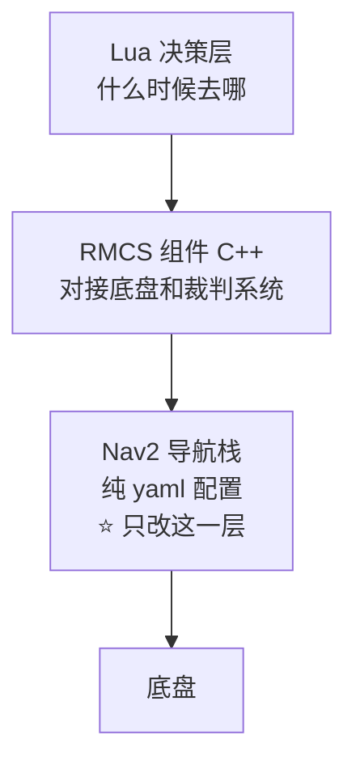

# 导航方向 · 任务规划与教学指南

> 这份文档是**给你自己用的**：告诉你每一步怎么做、为什么这么做、踩到坑怎么办。
> 结论汇总见 [导航提交作业.md](导航提交作业.md)；实测数据见 [实验记录.md](实验记录.md)。

---

## 一、先搞懂这四件事（动手之前）

### 1.1 三层结构，你只改最下面那层


```mermaid
flowchart TB
    A["Lua 决策层<br/>什么时候去哪"] --> B["RMCS 组件 C++<br/>对接底盘和裁判系统"]
    B --> C["Nav2 导航栈<br/>纯 yaml 配置<br/>⭐ 只改这一层"]
    C --> D["底盘"]
```

| 层 | 语言 | 干嘛的 | 要改吗 |
|---|---|---|---|
| Lua 决策（`src/lua/`） | Lua | 决定"现在去哪"（巡逻、跨场、回防） | ❌ |
| RMCS 组件（`src/cxx/`） | C++ | 把导航和底盘接起来 | ❌ |
| **Nav2 配置（`config/`）** | **yaml** | **规划路径、跟踪路径** | ✅ **只改这里** |

**说人话**：你这次的任务，**全部工作量就是改几行 yaml + 调一堆数字**。别去碰 C++ 源码，
那是给自己挖坑（任务是"换规划器 + 调参"，不是"写算法"）。

### 1.2 全局 vs 局部，你要换的是左边那个

| | 全局规划器 | 局部规划器（MPPI） |
|---|---|---|
| 多久跑一次 | **1 秒**（行为树锁死） | **每 0.05 秒**（20 Hz） |
| 干嘛的 | 看整张地图，规划"大概怎么走" | 看眼前，实际避障 + 跟踪 |
| 视野 | 整张场地（29.2 × 16.1 m） | 眼前 16 × 16 m |
| 输出 | 一条路径 | 速度指令 |
| 要改吗 | ✅ **就是它** | ❌ 已为全向底盘调好 |

**打个比方**：全局规划器 = 出门前看导航定路线；局部规划器 = 开车时打方向盘躲障碍。

> ⚠️ 搞混这两个，后面全错。你要换的是"看导航定路线的那个"。

### 1.3 "地图"有两个意思，别混

| 种类 | 在哪 | 长什么样 | 给谁用 |
|---|---|---|---|
| **① Nav2 栅格地图** | `maps/*.png` + `*.yaml` | 图片（黑=障碍，白=能走） | **规划器** ← 和你相关 |
| ② Lua 路径点模型 | `src/lua/map/*.lua` | **代码** | 决策层（去哪） |

> `train.lua` 是第 ② 类，**是代码不是图片**，和你调参没关系。

**① 里有哪些地图**（真车/静态默认都是 `rmuc`，但**现场验收用 `战队`**）：

| 文件 | 尺寸 | 分辨率 | 覆盖 |
|---|---|---|---|
| `rmuc.yaml` → `rmuc-v2.png` | 292×161 | 0.1 m/格 | x[-4.3,24.9] y[-8,8.1] = 29.2×16.1 m（全场 CAD 图） |
| `rmuc-v3.png` | 292×161 | — | 孤儿（v2 的微调版，没人引用） |
| `rmuc.png` | 292×161 | — | 孤儿（最老版本，缺中部四个六边形障碍） |
| `rmul.yaml` → `rmul.png` | 240×160 | 0.05 m/格 | 12×8 m（RMUL 场） |
| **`战队.yaml` → `战队.png`** | 343×110 | 0.1 m/格 | **x[-10,24.3] y[-4,7] = 34.3×11 m**<br>**实扫半场图，带噪点 ← 现场验收用这张** |
| `empty.yaml` → `empty.png` | 2000×2000 | 0.05 m/格 | 空图，局部地图 mock 用 |

> `战队.png` 是**实扫图**：左边（x < 0）噪点多、很挤；**右边 x≈10~24 是开阔区**。
> 坐标怎么算见 §十。

**换地图不用改文件**，启动时给参数就行：

```bash
ros2 launch rmcs-navigation static.launch.yaml global_map:=战队
```

### 1.4 你要交什么

| 交付物 | 内容 | 放哪 |
|---|---|---|
| 代码改动 | `motion.yaml`（换规划器 + 调参） | 你自己 fork 的 `rmcs-navigation` |
| 提交报告 | 为什么选它 / 差异 / 调参思路 | 本仓库 `导航提交作业.md` |
| 演示 | 基线 vs 新规划器的对比录屏 | 本仓库 `assets/` |

---

## 二、环境与启动

### 2.1 目录地图：我在哪、改哪个

```
/workspaces/RMCS/                      ← 容器内唯一项目目录（容器名 LIGEON）
│
├─ docs/zh-cn/算法组考核/               ★ 本文件夹（你写文档的地方）
│
├─ rmcs_ws/                            ROS2 工作空间
│   ├─ build/ install/ log/            编译产物（别手动改）
│   └─ src/
│       ├─ rmcs_core/ rmcs_bringup/ …  官方框架（别动）
│       └─ rmcs-navigation-deps/       导航依赖栈（第三方）
│           ├─ rmcs-navigation/        ★★★ 你的主战场
│           │   ├─ config/motion.yaml      ★ 你改的参数在这
│           │   ├─ config/motion.xml       行为树（重规划频率）
│           │   ├─ launch/static.launch.yaml  ★ 实验台
│           │   ├─ maps/                   场地地图
│           │   └─ src/                    ❌ 不要动
│           ├─ rmcs-local-map/         局部地图（不动）
│           ├─ rmcs-localization/      定位（不动）
│           ├─ point-lio/              里程计（不动）
│           └─ livox-ros-driver2/ 等   雷达驱动（不动）
│
└─ rmcs_motor_demo/ navigation_ws/ …   往期作业
```

### 2.2 命令速览：其实很简单

先看结论——**日常只有两条命令**：

```bash
# 启动导航栈（在任意目录敲都行）
ros2 launch rmcs-navigation static.launch.yaml

# 调参：直接改 yaml，然后重启上面的命令。不用编译！
vim /workspaces/RMCS/rmcs_ws/src/rmcs-navigation-deps/rmcs-navigation/config/motion.yaml
```

**为什么这么简单？** 因为环境早就配好了：

| 你可能以为要做的事 | 实际 |
|---|---|
| `source /opt/ros/jazzy/setup.bash` | ❌ 不用。`.zshrc` 第 107 行 `source ~/env_setup.zsh` 已自动做掉 |
| `source install/setup.bash` | ❌ 不用。`env_setup.zsh` 里已 source 工作区的 `local_setup.zsh` |
| `export PATH=/opt/cmake/bin:$PATH` | ⚠️ **只在编译时**需要（见下） |
| 改 yaml 后要 `colcon build` | ❌ **不用！** 见 §2.3 |

**验证环境已就绪**（顺手确认一下）：

```bash
ros2 pkg prefix rmcs-navigation
# 期望输出：/workspaces/RMCS/rmcs_ws/install/rmcs-navigation
# 能输出就说明环境全好了，啥都不用 source
```

> **为什么之前文档里那些命令那么长？** 因为踩过一个坑：zsh 下执行
> `source /opt/ros/jazzy/setup.bash` 会**静默失效**（该脚本用 `BASH_SOURCE[0]` 定位自己，
> zsh 里这个变量是空的，于是它跑到当前目录找 `setup.sh`，报
> `no such file: .../rmcs_ws/setup.sh`）。
> **但根本不需要 source 它** —— `.zshrc` 里已经用 `.zsh` 版本配好了。

### 2.3 什么时候才需要编译？

**改配置不用编译！** 因为编译时用了 `--symlink-install`，
`install/` 里的配置是**指向源文件的符号链接**：

```
install/rmcs-navigation/share/rmcs-navigation/config/motion.yaml
   └─ 软链到 → src/.../rmcs-navigation/config/motion.yaml
```

所以改了源文件，`install/` 里**立刻就是新的**（其实是同一个文件）。

| 你改了什么 | 要编译吗 | 要做什么 |
|---|---|---|
| `config/motion.yaml`（**调参主要在这**） | ❌ 不用 | 改完**重启 launch** 即可 |
| `config/motion.xml`（行为树） | ❌ 不用 | 同上 |
| `launch/*.yaml` | ❌ 不用 | 同上 |
| `maps/*.png`、`*.yaml` | ❌ 不用 | 同上（换地图也可用启动参数，见 §2.5） |
| `src/cxx/**`（C++ 源码） | ✅ 要 | 但**本任务不改源码** |

> ⚠️ **前提是编译时带了 `--symlink-install`**。所以首次构建务必加上这个参数（见下）。

**首次搭建才需要编译一次**（一次性，之后基本用不上）：

```bash
cd /workspaces/RMCS/rmcs_ws
PATH=/opt/cmake/bin:$PATH colcon build --packages-up-to rmcs-navigation --symlink-install
```

| 要点 | 说明 |
|---|---|
| `PATH=/opt/cmake/bin:$PATH` | **必须**。`rmcs-navigation` 的 `CMakeLists.txt` 要求 CMake ≥ 3.30，系统自带是 3.28（会报 `CMake 3.30 or higher is required`）；`/opt/cmake/bin/cmake` 是 4.2.3 |
| `--symlink-install` | **必须**。有了它改配置才不用重编译 |
| `--packages-up-to` | 首次要带上（连依赖一起建）；依赖建好后日常用 `--packages-select` 就够 |
| 别用 `build-rmcs` | 它默认 `--merge-install`，与现有 isolated 布局冲突，报 `install directory was created with the layout 'isolated'` |

> 注：`PATH=... cmd` 这种写法在 zsh 里可以直接用，无需 `bash -lc` 或 `export`。

### 2.4 实验台：不需要机器人就能跑

`rmcs-navigation` 自带 `launch/static.launch.yaml`，专为**纯软件联调**设计——
**不用 C 板、不用雷达、不用定位**，就能把整个 Nav2 链路撑起来。

```bash
ros2 launch rmcs-navigation static.launch.yaml
```

**它是怎么做到的？** 用两招"假装"：

| 假装的东西 | 用什么装 | 效果 |
|---|---|---|
| 局部地图 | `map_server` 加载 `empty.yaml`（全空的图） | 局部代价地图永远是空的（没有障碍） |
| 机器人位置 | 两个**静态 TF**：`world→odom`、`odom→base_link` | 机器人永远"停在"原点 |

它会启动的东西：
- `global_map`（真地图 `rmuc-v2.png`）+ `local_map`（假空图）
- `bt_navigator` / `planner_server` / `controller_server`（导航三兄弟）
- `foxglove_bridge`（给你看数据的接口）
- 两个静态 TF

**不会启动**：传感器驱动、SLAM、定位、`rmcs_local_map`、`point_lio`。

启动成功的标志：`foxglove_bridge` 打印 `Server listening on port 8765`。

### 2.5 换地图

不用改文件，启动时给参数即可：

```bash
ros2 launch rmcs-navigation static.launch.yaml global_map:=战队
```

### 2.6 ⚠️ 每次实验前必做：清理残留进程

导航进程**极易遗留**（`AGENTS.md` 专门警告过，称它们容易变僵尸进程）。
不清的话会出现两个症状：

1. **节点重复实例**（`ros2 node list` 里每个节点出现两次）
2. **端口被占**（`foxglove_bridge` 报 `Bind Error`）

```bash
pkill -f 'ros2 launch rmcs-navigation'; sleep 2
for p in nav2_lifecycle_manager nav2_bt_navigator nav2_planner nav2_controller \
         nav2_map_server foxglove_bridge static_transform_publisher; do
  pkill -f "$p"
done
sleep 2
ps aux | grep -E 'nav2|ros2 launch|foxglove' | grep -v grep | wc -l   # 应该输出 0
```

**养成习惯**：每次开实验前先跑一遍，确认是 0 再启动。

### 2.7 静态跑一遍：手把手

#### 先立个预期：能验证什么、不能验证什么

| ✅ 能验证 | ❌ 不能验证 |
|---|---|
| 导航栈能否正常启动 | 机器人**移动**（TF 是静态的） |
| 规划器参数是否加载生效 | 局部代价地图**滚动** |
| **路径质量**（形状、转折数、长度） | 路径**跟随**效果 |
| 规划耗时、`/plan` 频率 | 实车动力学（加减速、打滑） |

> 所以静态环境是**专门用来调规划器参数的实验台**，正好对口本任务。
> 要"看车动起来"得接虚拟底盘（§3.2）。

#### 步骤 0｜清理残留（每次必做）

见 §2.6，跑完确认输出 `0`。

#### 步骤 1｜启动（终端 A）

```bash
ros2 launch rmcs-navigation static.launch.yaml
```

**这条命令会一直占着终端**（前台运行），别关它。

#### 步骤 2｜等约 20 秒，找三个成功信号

在这个终端里找这三行（顺序可能不同）：

```
[foxglove_bridge]   Server listening on port 8765                    ← 数据接口就绪
[map_server]        Read map rmuc-v2.png: 292 X 161 map @ 0.1 m/cell ← 场地地图加载
[lifecycle_manager] Managed nodes are active                         ← 导航节点全激活
```

⚠️ **不要一启动就查节点**。节点注册要时间 —— 实测在第 16 秒查时 `planner_server`
还没出现，**第 24 秒才齐**。这不是故障，是**没等够**。

#### 步骤 3｜另开终端验证（终端 B）

```bash
ros2 node list
# 期望 15 个，关键的这些：
#   /bt_navigator  /planner_server  /controller_server
#   /global_map  /local_map
#   /global_costmap/global_costmap  /local_costmap/local_costmap

for n in bt_navigator planner_server controller_server global_map local_map; do
  printf "%-18s %s\n" "$n" "$(ros2 lifecycle get /$n | head -1)"
done
# 期望：5 个全是 active [3]

ros2 param get /planner_server GridBased.plugin
# 期望：nav2_navfn_planner::NavfnPlanner    ← 基线确认
```

#### 步骤 4｜发目标点（终端 B）

静态环境下推荐用 **`ComputePathToPose`**（只算路径、不跑车）：

```bash
ros2 action send_goal /compute_path_to_pose nav2_msgs/action/ComputePathToPose \
  "{goal: {header: {frame_id: world}, pose: {position: {x: 20.0, y: 0.0, z: 0.0}}}, use_start: false}"
```

期望结尾：

```
Goal accepted with ID: ...
error_code: 0
Goal finished with status: SUCCEEDED
```

> 输出很长（含 824 个位姿点），`error_code` 要往上翻一下才能看到。
> 起点不用给 —— `use_start: false` 表示"用机器人当前位置"，静态下就是 `world(0,0)`。
> 换终点就改 `x`/`y`；可用点举例：`(20,0)` `(12,3)` `(12,-3)` `(-3,0)`

**另一种：完整导航（会失败，属预期）**

```bash
ros2 action send_goal /navigate_to_pose nav2_msgs/action/NavigateToPose \
  "{pose: {header: {frame_id: world}, pose: {position: {x: 20.0, y: 0.0, z: 0.0}}}}"
```

⚠️ 它**一定会 `Goal failed`**，并且会反复重试约 1 分钟。**这是预期行为不是故障**：

> 车不动 → `SimpleProgressChecker`（容差 4 秒）检测不到位移 → 判"无进展"
> → 清代价地图重试 → `RecoveryNode` 重试耗尽 → 失败。

#### 步骤 5｜观察结果

| 看什么 | 怎么做 |
|---|---|
| 路径**长什么样** | Foxglove 连 `ws://localhost:8765`，3D 面板加 `/plan`（见 §3.3） |
| 路径**质量（数字）** | `python3 tools/plan_metrics.py --duration 60` → 看转折密度 |
| 规划频率 | `ros2 topic hz /plan` → 应约 1 Hz |
| 代价地图分布 | `python3 tools/costmap_probe.py` |

#### 步骤 6｜停止与清理

终端 A 按 **Ctrl+C**，然后跑一遍 §2.6 的清理。

> 不清理的话，下次启动会遇到节点重复 + 端口占用。

#### 常见现象速查

| 现象 | 是故障吗 | 说明 |
|---|---|---|
| 刚启动查不到 `planner_server` | ❌ 不是 | 没等够，约 20 秒后才齐 |
| `Goal failed` | ❌ 不是 | 静态环境车不动，进度检查必然失败 |
| 找不到 `ComputePathToPose` action | ⚠️ 是 | 栈没起、或还没起完 |
| 节点重复 / `Bind Error` | ⚠️ 是 | 残留进程，跑 §2.6 清理 |
| `Control loop missed its desired rate` | ⚠️ 是 | MPPI 局部控制器丢帧（实测 15.8/20 Hz），见 §3.4 证据 3 |

#### 一页流程（贴在终端旁）

```
① 清理   pkill -f 'ros2 launch rmcs-navigation'; ...   （§2.6）
② 启动   ros2 launch rmcs-navigation static.launch.yaml     ← 终端 A，等 20 秒
③ 验证   ros2 node list / lifecycle get / param get         ← 终端 B
④ 规划   ros2 action send_goal /compute_path_to_pose ...    ← 终端 B
⑤ 观察   plan_metrics.py / Foxglove / topic hz /plan
⑥ 清理   Ctrl+C 后重跑 §2.6
```

---

## 三、★ 怎么看到"动态过程"（Foxglove 观测教学）

这一节是重点：**光有数据不够，你得亲眼看到车怎么走、路径怎么变。**

### 3.1 先解决一个问题：静态环境里车不会动

前面说过，`static.launch.yaml` 的 `odom→base_link` 是**静态 TF**，
所以机器人**永远停在原点**。后果：

| ✅ 能看到 | ❌ 看不到 |
|---|---|
| 路径被规划出来（`/plan`，1 Hz 刷新） | 机器人**移动** |
| 全局代价地图（固定不动） | 局部代价地图**滚动** |
| `/cmd_vel` 被算出来 | MPPI **跟踪**效果 |

**要让画面动起来，必须让 `base_link` 动。** 两种办法：

| 办法 | 做法 | 成本 |
|---|---|---|
| **轻量（推荐）** | 杀掉静态 TF，用 `tools/virtual_chassis.py` 积分 `/cmd_vel` 发布动态 TF | 零依赖，秒级启动 |
| 重量 | 上 Gazebo 仿真 | 要装仿真包、建模型、配插件，工作量大 |
| 最终 | 实车 | 需要硬件 |

> **虚拟底盘是什么**：一个小程序，订阅 `/cmd_vel`（局部控制器给的指令），
> 按质点运动学积分出位置，再发布**动态的** `odom→base_link`。
> 这样"规划 → 控制 → 运动 → 再规划"的闭环就活了，
> 你能看到车真的沿着路径走、代价地图真的在滚动。

### 3.2 四步跑起来

> 以下命令**都不用 source、不用 bash -lc**（原因见 §2.2），直接敲就行。

**步骤 0 · 清理残留**（见 §2.6）

**步骤 1 · 启动导航栈（终端 A）**
```bash
ros2 launch rmcs-navigation static.launch.yaml
```
期望看到 `Server listening on port 8765`。

**步骤 2 · 换成动态 TF（终端 B）**
```bash
# ① 杀掉静态的 odom->base_link（world->odom 保留）
pkill -f "static_transform_publisher 0 0 0 0 0 0 odom base_link"

# ② 启动虚拟底盘（路径按实际情况调整）
python3 /workspaces/RMCS/docs/zh-cn/算法组考核/tools/virtual_chassis.py
```
期望每秒一行位姿日志：
```
[virtual_chassis] 虚拟底盘已启动 | 模式=cmd_vel 速度=0.6 m/s 频率=30.0 Hz
[virtual_chassis] 位姿 (  0.000,   0.000) 偏航    0.0° | cmd_vel vx=+0.000 vy=+0.000
```

> ⚠️ **不杀静态 TF 会怎样**：两个发布者同时发 `odom→base_link`，
> 位置在两个值之间跳，画面表现为**抖动**。

**步骤 3 · 发目标点（终端 C）**
```bash
ros2 action send_goal /navigate_to_pose nav2_msgs/action/NavigateToPose \
  "{pose: {header: {frame_id: world}, pose: {position: {x: 20.0, y: 0.0, z: 0.0}}}}"
```
或者在 **Foxglove 里点**（更直观）：3D 面板左上角工具栏选 **Publish**，
topic 选 `/goal_pose`，在地图上点一下。

**步骤 4 · 用你自己的 Foxglove 连**

> ⚠️ 用**桌面端 Foxglove**，不是网页版。容器是 `network_mode: host`，
> 所以你本机可以直接连 `localhost`。

1. 打开 Foxglove 桌面端 → **Open connection**
2. 选 **Foxglove WebSocket**
3. URL：`ws://localhost:8765`
4. 连接

连不上就先在终端确认端口：
```bash
netstat -tln | grep 8765     # 应看到 LISTEN
```

### 3.3 面板怎么配

#### 3D 面板（主视图）

**Fixed frame 设成 `world`**（面板左上角）。然后按顺序添加话题——
**后加的在上面**（图层叠放顺序）：

| 话题 | 作用 | 建议设置 |
|---|---|---|
| `/map` | 静态场地地图 | Color mode: `map`，Alpha 0.6 |
| `/global_costmap/costmap` | **全局代价地图**（看膨胀范围） | Color mode: `costmap`，Alpha 0.5 |
| `/local_costmap/costmap` | **局部代价地图**（会随车滚动） | Color mode: `costmap`，Alpha 0.4 |
| `/plan` | **全局路径** ★ | 亮绿色，线宽 3 |
| `/global_costmap/published_footprint` | 机器人轮廓 | 醒目颜色 |

#### Plot 面板（**看"卡顿"的关键**）

| 系列 | 话题 | 字段 | 看什么 |
|---|---|---|---|
| 线速度 | `/cmd_vel` | `linear.x` | 是否平滑；有无周期性凹陷 |
| 横向速度 | `/cmd_vel` | `linear.y` | 全向底盘是否各向均衡 |
| 角速度 | `/cmd_vel` | `angular.z` | 配置里锁死为 ~0.001 |

> **"跟踪卡顿"在 Plot 里长什么样**：曲线出现**周期性凹陷**——
> 每次路径转弯，控制器就要减速转向，速度掉下去再爬起来。
> 路径转折越多（NavFn 有 368 个），凹陷越密集，看起来就是"一顿一顿"。

#### 其他面板

| 面板 | 用途 |
|---|---|
| **Raw Messages** | 看 `/plan` 的 `poses` 数组长度 = 路径点数 |
| **Topic Graph** | 一眼看出话题连接与频率异常 |
| **Diagnostics** | `/diagnostics` 健康信息 |

### 3.4 怎么用 Foxglove 看出"卡顿"（三个证据）

**证据 1 · 路径是锯齿**（3D 面板）
放大看 `/plan`：NavFn 输出的是**格子级阶梯折线**，一格一格拐。
转折越密，跟踪越容易顿。

**证据 2 · 速度曲线周期性凹陷**（Plot 面板）
看 `/cmd_vel.linear.x`：每过一个转折速度就掉一次。
换成 Smac2D（有平滑器）后，凹陷应明显减少。

**证据 3 · 控制环丢帧**（终端日志）
`controller_server` 会打印：
```
Control loop missed its desired rate of 20.0000 Hz. Current loop rate is 15.5~15.9 Hz.
```
说明局部控制器 MPPI 算不过来（负载高）。不是规划器问题，但也是"卡顿"成分。

### 3.5 切换规划器后怎么对比

同一套流程，改完 `motion.yaml` 重启，重点对比：

| 观察项 | 在哪看 | NavFn 基线 | Smac2D 预期 |
|---|---|---|---|
| 路径形状 | 3D `/plan` | 锯齿、转折密 | **平滑、转折少** |
| 转折点数 | Raw Messages 数 `poses` | 368 | 显著减少 |
| 速度曲线 | Plot `/cmd_vel.linear.x` | 凹陷密集 | **凹陷减少** |

**建议录屏**：两版各跑同一组起终点，并排录下来 —— 这是验收"效果演示"最有力的材料。

### 3.6 常见问题

| 现象 | 原因 | 解决 |
|---|---|---|
| Foxglove 连不上（红点） | 栈没起 / 端口被占 | 看终端 A 有无 `listening on port 8765`；`netstat -tln \| grep 8765` |
| 画面位置**抖动** | 静态 TF 和虚拟底盘同时发 `odom→base_link` | 执行步骤 2 的 `pkill` |
| 机器人**不动** | 没发目标点；或 `/cmd_vel` 是 0 | 发目标点；看终端 B 的位姿日志 |
| 节点**重复** | 残留进程 | 执行步骤 0 清理 |
| `Goal failed` 反复 | 静态环境下进度检查判无进展 | 用虚拟底盘让车真动起来 |

---

## 四、分阶段执行计划

### 阶段 0 · 理解与确认

| | |
|---|---|
| 目标 | 确认基线、搞清改哪里 |
| 操作 | 读本文 + [导航提交作业.md](导航提交作业.md)；**问组长两件事**（见下） |
| 验收 | 能答：现在用什么规划器？改成什么？改哪个文件？ |

**要问组长的两件事**：
1. `rmcs-navigation-deps` 默认 pin 的 `d57fa1c` **编译不过**（缺依赖声明），
   我改用上游 `main` 可以吗？（顺便反馈"父仓库子模块指针该更新了"）
2. 细则说"地图会给出"，但仓库里已有 `rmuc-v2.png` 等多张，**以哪张为最终验收场地**？

### 阶段 1 · 跑通实验台

| | |
|---|---|
| 目标 | 无机器人跑起导航栈，建立信心 |
| 操作 | §2.2 确认环境 → §2.4 启动 → 下面三条检查 |
| 验收 | 5 节点全 `active`，能查到规划器类名 |

```bash
ros2 node list
# 期望：/bt_navigator /planner_server /controller_server /global_map /local_map

for n in planner_server controller_server bt_navigator global_map local_map; do
  printf "%-20s %s\n" "$n" "$(ros2 lifecycle get /$n | head -1)"; done
# 期望：全是 active [3]

ros2 param get /planner_server GridBased.plugin
# 期望：nav2_navfn_planner::NavfnPlanner   ← 基线确认
```

### 阶段 2 · 看懂效果（Foxglove 动态观察）

| | |
|---|---|
| 目标 | 亲眼看到 NavFn 的锯齿路径和速度凹陷 |
| 操作 | 按 §3.2 四步跑起来 + §3.3 配面板 + §3.4 找三个证据 |
| 验收 | 能指出"路径哪里锯齿""速度曲线哪里凹陷" |

**先做基线录屏**——没有基线，后面讲"差异"就是空谈。

### 阶段 3 · 体检地图与参数

| | |
|---|---|
| 目标 | 找出可能"堵死/无解"的地方 |
| 操作 | 打开 `maps/rmuc-v2.png` 量最窄通道；核对 footprint 不一致 |
| 验收 | 能判断 0.5 m 膨胀会不会堵死门洞 |

**记住这组数**：

| 量 | 值 | 换算成格（0.1 m/格） |
|---|---|---|
| 车宽（局部 footprint） | 0.495 m | ≈ 5 格 |
| `inflation_radius` | 0.5 m | 5 格 |
| 全局 footprint | 0.2 m | 2 格 ⚠️ 与局部差 2.5 倍 |

**判据**：通道能过的条件 ≈ 宽度 > 车宽 + 2×膨胀 = 0.495 + 1.0 = **1.495 m**。
窄于 1.5 m 的通道有"无解"风险 —— 这是首要体检目标。

### 阶段 4 · 三种规划器横向对比 ⭐

| | |
|---|---|
| 目标 | 三种都跑一遍，用**数据**选出最合适的 |
| 操作 | 逐个改 `plugin:` → 重启 → 跑规划 → 测数据 + 画图 |
| 验收 | 能拿出一张三者对比图 + 一张指标表，并说清为什么选它 |

#### 4.1 为什么要 "都跑一遍"

选型不能靠"看起来"，要靠数据。而且实测发现一件事：

> **"转折数少"不等于"更平滑"** —— 详见 4.5，这是本阶段最容易踩的坑。

#### 4.2 三种规划器速览

| 规划器 | 插件类名 | 怎么找路 | 特点 |
|---|---|---|---|
| **NavFn** | `nav2_navfn_planner::NavfnPlanner` | 单分辨率栅格 A\*（势场） | 老牌、稳；输出格子级折线 |
| **ThetaStar** | `nav2_theta_star_planner::ThetaStarPlanner` | A\* + **视线检测**，可走任意角度 | 段少但拐弯硬 |
| **Smac2D** | `nav2_smac_planner::SmacPlanner2D` | A\* + **多分辨率降采样** + **平滑器** | 拐弯平滑（**选中**） |

**各自的参数**（换了插件，参数名也跟着变，互不通用）：

| 规划器 | 主要参数 |
|---|---|
| NavFn | `tolerance` `use_astar` `allow_unknown` |
| ThetaStar | `how_many_corners` `w_euc_cost` `w_traversal_cost` |
| Smac2D | `cost_penalty` `downsampling_factor` `smoother.*` |

> ✅ **好消息**：不匹配的参数会被**静默忽略**，规划器用内置默认值 ——
> 所以**只改 `plugin:` 一行就能切换并正常工作**，不影响你快速横向对比。
>
> ⚠️ **要知道**：这也意味着切换后跑的是**默认参数**，不是你想要的参数。
> 确定选哪个之后，再按阶段 5 补上专属参数。

#### 4.3 切换与测量（每个规划器做一遍）

```bash
# ① 改 plugin（只改这一行，不用编译）
cd /workspaces/RMCS/rmcs_ws/src/rmcs-navigation-deps/rmcs-navigation
vim config/motion.yaml
#   把 plugin: "..." 换成上表里的类名

# ② 重启（Ctrl+C 停掉旧的，再跑一遍）
ros2 launch rmcs-navigation static.launch.yaml     # 等约 20 秒

# ③ 确认切换成功
ros2 param get /planner_server GridBased.plugin

# ④ 另开终端，跑同一组起终点，把输出存下来
ros2 action send_goal /compute_path_to_pose nav2_msgs/action/ComputePathToPose \
  "{goal: {header: {frame_id: world}, pose: {position: {x: 20.0, y: 0.0, z: 0.0}}}, use_start: false}" \
  > /tmp/plan_<名字>.txt

# ⑤ 测量
cd /workspaces/RMCS/docs/zh-cn/算法组考核
python3 tools/plan_metrics.py --duration 20      # 看拐角指标
```

**全部跑完后，画一张对比图：**

```bash
python3 tools/plot_path.py assets/path_compare_three.png \
  --title "Same start & goal - three global planners compared" \
  "NavFn:/tmp/plan_navfn.txt" \
  "ThetaStar:/tmp/plan_theta.txt" \
  "Smac2D:/tmp/plan_smac2d.txt"
```

> **关键**：三次必须用**同一组起终点**，否则数据没有可比性。
> **配色固定按传参顺序**：①红 NavFn ②蓝 ThetaStar ③绿 Smac2D，顺序别换。

#### 4.4 实测参考数据（可用来对照你自己的结果）

同一起终点 `world(0,0)` → `(20,0)`，**都是默认参数**：

| 规划器 | 长度 | 转折数 | 最大转角 | 转角总和 | 急转(>45°) |
|---|---|---|---|---|---|
| NavFn | 41.53 m | 368 | **179.8°** | 18303° | **103 次** |
| ThetaStar | 35.68 m | **35** | 63.4° | 762° | 1 次 |
| **Smac2D** | **35.55 m** | 43 | **10.1°** | **282°** | **0 次** |


*红=NavFn 蓝=ThetaStar 绿=Smac2D（单张大图见 `assets/path_navfn.png` 等三张）*

#### 4.5 ⚠️ 关键坑：转折数少 ≠ 更平滑

看上面的表——**ThetaStar 的转折数（35）比 Smac2D（43）还少**！
如果只看这一列，会得出"ThetaStar 更平滑"的**错误**结论。

补看**转角有多尖**，结论立刻反转：

| | ThetaStar | Smac2D |
|---|---|---|
| 转折数 | 35（少） | 43（略多） |
| **最大转角** | 63.4° | **10.1°** |
| **急转(>45°)** | 1 次 | **0 次** |
| 风格 | **少而尖** —— 硬拐弯 | **多而缓** —— 平顺曲线 |

**为什么会有这个差别？**

- **ThetaStar** 用"视线检测"能走任意角度 → 路径是**长直线段拼接**，
  段数少，但每段之间是**硬拐**（像折线尺画的）。
- **Smac2D** 有平滑器 → 把一个拐弯**摊成很多个小角度**（像圆滑的曲线）。

**为什么急转才是问题？**

> 对局部控制器（MPPI）来说，**63° 的急转必须减速才能拐过去**；
> 而 10° 的缓弯可以接近全速通过。
> 所以"顿挫感"来自**转角的尖锐程度**，而不是转折的**个数**。

**结论**：判断路径平滑度，要看 **`max`（最大转角）/ `sum`（转角总和）/ `sharp`（急转次数）**，
不能只看转折数。

#### 4.6 决策

综合数据，选 **Smac2D**：

| 理由 | 数据支撑 |
|---|---|
| 路径最短 | 35.55 m（NavFn 41.53 m） |
| **零急转** | 急转 0 次，最大转角仅 10.1° |
| 转角总和最小 | 282° ≈ NavFn 的 **1/65** |
| 平滑是内置的 | 不用自己写后处理 |

> 怎么讲给组长（验收①的答案）：
> *"三种都实测了。NavFn 最大转角 179.8°、103 次急转，路径是极端锯齿；
> ThetaStar 转折虽少但拐得硬（63°）；Smac2D 零急转、转角总和仅为 NavFn 的 1/65，
> 所以选它。"*

### 阶段 5 · 落盘选定规划器

| | |
|---|---|
| 目标 | 把选定的 `SmacPlanner2D` 配置**完整写好**并生效 |
| 操作 | 在 `GridBased` 段补上 Smac2D 专属参数 → 重启 → 验证 |
| 验收 | `ros2 param get` 输出 `SmacPlanner2D`，且专属参数已生效 |

> ⚠️ **换插件必须改 yaml + 重启**。`ros2 param set` 改不了插件类名（启动时就确定了），
> 它只能调**数值型**参数。

```bash
# 备份原配置（便于回退对比）
cd /workspaces/RMCS/rmcs_ws/src/rmcs-navigation-deps/rmcs-navigation
cp config/motion.yaml config/motion.yaml.navfn-baseline
```

改 `GridBased` 段（**只改这一段**）：

```yaml
GridBased:
  plugin: "nav2_smac_planner::SmacPlanner2D"   # ← 核心就这一行
  tolerance: 0.5
  allow_unknown: true
  use_final_approach_orientation: false
  # Smac2D 专属参数（先给保守初值，后面再调）
  max_iterations: 1000000
  max_on_approach_iterations: 1000
  cost_penalty: 2.0
  downsampling_factor: 2
  smoother:
    max_iterations: 1000
    w_smooth: 0.3
    w_data: 0.2
    tolerance: 1.0e-10
```

**改完不用编译**（因为 `--symlink-install` 下 `install/` 里是软链），
**Ctrl+C 停掉旧 launch，重新敲一遍启动命令**即可：

```bash
ros2 launch rmcs-navigation static.launch.yaml
```

然后验证（**别只看 plugin，也确认专属参数生效了**）：

```bash
ros2 param get /planner_server GridBased.plugin          # 应为 SmacPlanner2D
ros2 param get /planner_server GridBased.cost_penalty    # 应为 2.0
ros2 param get /planner_server GridBased.smoother.w_smooth
```

### 阶段 6 · 调参消除卡顿（核心）

| | |
|---|---|
| 目标 | 达到"无明显卡顿" |
| 操作 | 按 §5.2 顺序，**一次只改一个**，记录现象 |
| 验收 | `/plan` 频率稳定 + `/cmd_vel` 无明显凹陷 |

### 阶段 7 · 跨场验证与交付

| | |
|---|---|
| 目标 | 跑通跨场 + 提交留痕 |
| 操作 | 静态栈验证规划连通性 → 实机跨场（如有条件）→ 提交 |
| 验收 | 门洞可通行、起伏路段可规划到对面；fork 上有 commit |

```bash
cd /workspaces/RMCS/rmcs_ws/src/rmcs-navigation-deps/rmcs-navigation
git add config/motion.yaml
git commit -m "feat(nav): 全局规划器由 NavFn 切换为 SmacPlanner2D

选型理由: 内置路径平滑解决折线转折降速; 多分辨率降采样提升大地图规划速度;
cost_penalty 显式障碍代价使路径走通道中间。
调参: cost_penalty 2.0->4.0, downsampling_factor 2->4, inflation_radius 0.5->0.35"
git push          # → origin = 你自己的 fork
```

---

## 五、调参教学

### 5.1 先判断"卡顿"是哪一种

| 类型 | 现象 | 根因 | 怎么测 |
|---|---|---|---|
| **规划卡顿** | 走一半停几秒再走 | 全局规划慢，`/plan` 迟迟不出 | `ros2 topic hz /plan` 看空档 |
| **跟踪卡顿** | 一直在走但一顿一顿 | 路径折线，转折处反复降速 | Plot 面板看 `/cmd_vel` 凹陷 |

**必须先判断类型再动手**，否则瞎调半天没效果。

> 前人踩过的坑（`doc/adjustment-navigation.md` 里写的）："远端联调必须流程化，
> 否则很容易被**假生效**误导"。所以调完参数**一定回读确认**。

### 5.2 调参顺序：从粗到细，一次只动一个

| 顺序 | 参数 | 现值 | 干嘛的 | 调过头会怎样 |
|---|---|---|---|---|
| 1 | `inflation_radius` | **0.5** | 障碍周围安全圈多大 | **门洞堵死 → 规划失败** |
| 2 | `cost_scaling_factor` | **0.5** | 代价衰减快慢（**越大越敢贴墙**） | 调大 → 贴墙；调小 → 过于保守，可能堵死窄道 |
| 3 | `cost_penalty`（Smac2D） | — | 障碍代价权重 | 过大 → 绕远 |
| 4 | `downsampling_factor`（Smac2D） | — | 降采样倍数 | 过大 → 路径粗糙 |
| 5 | `tolerance` | **0.5** | 终点允许偏差 | 过小 → 终点附近无解 |
| 6 | `smoother.w_smooth` / `w_data` | — | 平滑度 / 贴合原路径 | `w_data` 过小 → 平滑到撞障碍 |
| 7 | 重规划频率（`motion.xml`） | **1.0 Hz** | 多久重规划一次 | 过高 → 频繁重规划＝明显卡顿 |

**为什么"一次只动一个"**？因为验收会问你"调参思路"，
一次改一堆，你根本说不清是哪个参数起了作用。

### 5.3 两种调参方式，选一个

**方式 A：改 yaml + 重启**（推荐，最稳）

```bash
vim /workspaces/RMCS/rmcs_ws/src/rmcs-navigation-deps/rmcs-navigation/config/motion.yaml
# 存盘后，Ctrl+C 停掉 launch，重新跑：
ros2 launch rmcs-navigation static.launch.yaml
```

不用编译（`--symlink-install` 下配置是软链，见 §2.3）。

**方式 B：在线改数值参数**（试值快，但只对数值型有效）

```bash
ros2 param set /planner_server GridBased.cost_penalty 4.0
ros2 param get /planner_server GridBased.cost_penalty    # 回读确认生效
```

| | 方式 A（改 yaml 重启） | 方式 B（param set） |
|---|---|---|
| 生效范围 | 所有参数 | **只有数值型** |
| 换插件类名（如换 `SmacPlanner2D`） | ✅ | ❌ 不行 |
| 代价地图参数（`inflation_radius` 等） | ✅ | 部分可以，但改完可能要重激活 |
| 速度 | 慢（重启约 10 秒） | 快（即时） |
| 会不会"假生效" | 不会 | ⚠️ 可能（参数被读走后改的，需看是否真起作用） |

> **建议**：先用方式 B 快速试几个值找到方向，确定后**落回 `motion.yaml`**（方式 A）
> 再验证一次，确保重启后一致。最终提交的永远是 yaml。

试出满意值后，**再落回 `motion.yaml`** 形成提交。

### 5.4 每次改动都要记一行

报告里的调参表就是靠这个积累的：

```
改动: inflation_radius 0.5 -> 0.35
原因: 0.5 m 在 0.1 m 栅格上占 5 格, 狗洞被膨胀堵死, 规划失败
现象: 规划成功率恢复; /plan 输出恢复稳定
结论: 保留 0.35
```

---

## 六、命令速查

```bash
# —— 清理残留（每次实验前）——
pkill -f 'ros2 launch rmcs-navigation'; sleep 2
for p in nav2_lifecycle_manager nav2_bt_navigator nav2_planner nav2_controller \
         nav2_map_server foxglove_bridge static_transform_publisher; do pkill -f "$p"; done
sleep 2; ps aux | grep -E 'nav2|ros2 launch' | grep -v grep | wc -l   # 应为 0

# —— 首次构建（一次性；日常改配置不用跑）——
cd /workspaces/RMCS/rmcs_ws
PATH=/opt/cmake/bin:$PATH colcon build --packages-up-to rmcs-navigation --symlink-install

# —— 启动静态栈（终端A）——
ros2 launch rmcs-navigation static.launch.yaml

# —— 换地图 ——
ros2 launch rmcs-navigation static.launch.yaml global_map:=战队

# —— 动态 TF（终端B）——
pkill -f "static_transform_publisher 0 0 0 0 0 0 odom base_link"
python3 /workspaces/RMCS/docs/zh-cn/算法组考核/tools/virtual_chassis.py

# —— 发目标（终端C）——
ros2 action send_goal /navigate_to_pose nav2_msgs/action/NavigateToPose \
  "{pose: {header: {frame_id: world}, pose: {position: {x: 20.0, y: 0.0, z: 0.0}}}}"

# —— 换终点（试不同路径）——
#   空闲区参考：世界范围 x[-4.3, 24.9]  y[-8.0, 8.1]
#   可用点举例：(20,0) (12,3) (12,-3) (-3,0) (5,5) (15,-5)

# —— 看地图 / 标点（详见 §十）——
cd /workspaces/RMCS/docs/zh-cn/算法组考核
python3 tools/plot_path.py assets/map_zhandui_grid.png --map 战队 --grid 2 --scale 3   # 带世界坐标网格的底图
python3 tools/plot_path.py /tmp/zd_pick.png --map 战队 --grid 2 --scale 3 \
  --mark "14,0;23,0"                                                     # 标出候选终点

# —— 检查 ——
ros2 node list
ros2 param get /planner_server GridBased.plugin

# —— 频率（"无卡顿"的客观证据）——
ros2 topic hz /plan

# —— 环境自检（能输出就说明啥都不用 source）——
ros2 pkg prefix rmcs-navigation
```

> 日常只需要两条：`ros2 launch ...`（开跑）和 `vim .../motion.yaml`（改参数）。
> 其余都是排查/验证时才用。

### 三种规划器切换速查（阶段 4）

```bash
cd /workspaces/RMCS/rmcs_ws/src/rmcs-navigation-deps/rmcs-navigation
P=config/motion.yaml

# NavFn（基线）
sed -i 's|plugin: "nav2_[a-z_]*::[A-Za-z2]*"|plugin: "nav2_navfn_planner::NavfnPlanner"|' $P
# ThetaStar
sed -i 's|plugin: "nav2_[a-z_]*::[A-Za-z2]*"|plugin: "nav2_theta_star_planner::ThetaStarPlanner"|' $P
# Smac2D
sed -i 's|plugin: "nav2_[a-z_]*::[A-Za-z2]*"|plugin: "nav2_smac_planner::SmacPlanner2D"|' $P

# 每次改完：重启 → 确认 → 跑同一组起终点 → 存输出
grep 'plugin:' $P | head -1          # 看改对没
ros2 launch rmcs-navigation static.launch.yaml    # 另开终端，等 20 秒
ros2 param get /planner_server GridBased.plugin
ros2 action send_goal /compute_path_to_pose nav2_msgs/action/ComputePathToPose \
  "{goal: {header: {frame_id: world}, pose: {position: {x: 20.0, y: 0.0, z: 0.0}}}, use_start: false}" \
  > /tmp/plan_<名字>.txt

# 画对比图（顺序固定：红 NavFn / 蓝 ThetaStar / 绿 Smac2D）
cd /workspaces/RMCS/docs/zh-cn/算法组考核
python3 tools/plot_path.py assets/path_compare_three.png \
  --title "Same start & goal - three global planners compared" \
  "NavFn:/tmp/plan_navfn.txt" "ThetaStar:/tmp/plan_theta.txt" "Smac2D:/tmp/plan_smac2d.txt"
```

> ⚠️ `sed` 只改 `plugin:` 那一行；改前建议先 `cp $P /tmp/motion.yaml.bak`。

---

## 七、检查清单

**动手前**
- [ ] 能答：改哪一层？（Nav2 配置层）
- [ ] 能答：全局还是局部？（全局，1 Hz）
- [ ] 能答：`static.launch.yaml` 干嘛的？（无机器人跑导航栈的实验台）
- [ ] 能答：为什么不用 Hybrid？（全向底盘，无转弯半径限制）
- [ ] 能答：改动提交到哪？（自己 fork 的 `rmcs-navigation`）

**交付前**
- [ ] 实验台 5 节点全 `active`
- [ ] 基线（NavFn）已跑通 + **录屏**
- [ ] **三种规划器都跑过，有对比图 + 指标表**
- [ ] 理解"转折数少 ≠ 更平滑"（要看 max / sum / sharp）
- [ ] `SmacPlanner2D` 已落盘并确认生效（含专属参数）
- [ ] 调参记录表完整（改动 → 现象 → 结论）
- [ ] `/plan` 频率稳定的证据
- [ ] Foxglove 对比录屏（两版并排）
- [ ] fork 上有 commit 且已 push
- [ ] 三句话能讲：**为什么选它 / 和 NavFn 差在哪 / 调参怎么想的**

---

## 八、工作流与提交

### 8.1 三个仓库的分工

| 仓库 | 内容 | 何时用 |
|---|---|---|
| **`RMCS_Navigation`**（本文件夹） | 报告、规划、实验记录、配置快照、演示材料 | ✅ **过程中提交这里** |
| `rmcs-navigation`（fork） | `motion.yaml` 代码改动 | 改完规划器后 |
| `RMCS_Test`（作业主仓） | 最终版 | ⏳ **最后才提交** |

### 8.2 过程中的提交

```bash
# 本文件夹 → RMCS_Navigation
cd /workspaces/RMCS/docs/zh-cn/算法组考核
git add -A && git commit -m "报告: 补充 XX" && git push

# 代码改动 → 自己的 fork
cd /workspaces/RMCS/rmcs_ws/src/rmcs-navigation-deps/rmcs-navigation
git add config/motion.yaml && git commit -m "feat(nav): ..." && git push
```

### 8.3 最终版并入 `RMCS_Test`

```bash
cd /workspaces/RMCS/docs/zh-cn/算法组考核
git status && git push          # ① 确认已全部提交推送
rm -rf .git                     # ② 移除嵌套仓库标记（变成普通文件夹）

cd /workspaces/RMCS
# ③ 编辑 .gitignore，删掉这行：/docs/zh-cn/算法组考核/
git add -A "docs/zh-cn/算法组考核"
git commit -m "考核: 导航方向提交报告与配置快照"
git push                        # → RMCS_Test
```

> ⚠️ **顺序不能反**：必须先 `rm -rf .git`，否则作业仓会把它当成嵌套仓库（gitlink），
> 提交出来是**空壳**。

### 8.4 三个 md 的分工

| 文件 | 什么时候改 |
|---|---|
| [导航提交作业.md](导航提交作业.md) | **有实质进展时**才改，语言凝炼；没进展就不动 |
| 本文（任务规划.md） | 每次操作有变化时，**补对应的教学说明**（尽量通俗） |
| [实验记录.md](实验记录.md) | **每次实验后**追加一节：时间 + 执行 + 结果 + 问题 + 结论 |

### 8.5 时间预算

| 阶段 | 内容 | 估时 |
|---|---|---|
| 0 | 理解与确认（含问组长） | 0.5 天 |
| 1 | 跑通实验台 | 0.5 天 |
| 2 | 看懂效果（Foxglove 观察） | 0.5 天 |
| 3 | 体检地图与参数 | 0.5 天 |
| 4 | **三种规划器横向对比** | 0.5~1 天 |
| 5 | 落盘选定规划器 | 0.5 天 |
| 6 | **调参消除卡顿** | **1~2 天** |
| 7 | 跨场验证与交付 | 1 天 |
| | **合计** | **约 5~6 天** |

> 阶段 6 是核心，也是唯一可能反复的地方，留足时间。

---

## 九、★ 真车上车流程（远程部署）

### 9.1 先纠正一个认知

真车**不是**"远程遥控车"，而是**远程开发 + 部署**：

```
你（容器 /workspaces/RMCS）
  │  build-rmcs              ← 本地编译，产物在 rmcs_ws/install
  │  sync-remote             ← unison watch 持续同步
  ▼                            rmcs_ws/install → ssh://remote//rmcs_install
远端 remote = 127.0.0.1:2022 (root)   ← 真车
  │  service rmcs restart
  ▼
机器人：rmcs_executor + Nav2 + 传感器
```

`~/.ssh/config` 里的 `remote`：
```
Host remote
    HostName 127.0.0.1     ← 容器内 localhost（端口转发到真车）
    Port 2022
    User root
```

> **第一道门就是端口**：`127.0.0.1:2022` 不通，后面全白搭。

### 9.2 脚本清单（都在 `.script/`）

| 命令 | 干什么 |
|---|---|
| `set-robot sentry` | 设 `RMCS_ROBOT_TYPE`（**必须先设**，否则 `launch-rmcs` 直接报错） |
| `build-rmcs` | 本地编译 |
| `sync-remote` | unison `-repeat watch` 持续同步 `install/` → 远端 `//rmcs_install` |
| `wait-sync` | 等同步完成（读 `/tmp/sync-remote` socket） |
| `attach-remote` | 远端 `service rmcs attach` |
| `attach-remote -r` | 先 `restart` 再 `attach` |
| `ssh-remote "<cmd>"` | 远端执行（实质 `ssh -t -X remote`） |
| `rmcs-cli` | tmux 四窗口一条龙（control / sync / build / remote） |
| `remote-status` | 查 `/rmcs/service/robot_status` |
| `remote-context game_stage started` | **远端**注入比赛阶段 |
| `scan-remote` | 扫网段找机器人 |

### 9.3 标准流程

```bash
set-robot sentry            # 一次性

build-rmcs                  # 改完配置后编译
sync-remote                 # 另开终端常驻，持续同步
wait-sync                   # 等同步完

# 远端重启（双重 stop 防守护进程残留）
ssh-remote "bash -lc 'source ~/env_setup.bash && service rmcs stop; sleep 2; service rmcs stop || true; service rmcs start'"

attach-remote               # 看日志
```

> 残留进程会导致**同名节点重复实例**，行为变得诡异 —— 这是前人踩过的坑。

### 9.4 ⚠️ 三道隐藏门（不搞清，车一步都不会动）

#### 门 1 · 导航栈由**比赛阶段**触发

真车的 Nav2 **不是开机就起**。看 `src/lua/endpoint/rmuc.lua:122`：

```lua
if last_stage == GameStage.PREPARATION and stage ~= GameStage.PREPARATION then
    action:restart_navigation {
        global_map = "rmuc", launch_livox = true, launch_odin1 = false, use_sim_time = false,
    }
```

只有从 `PREPARATION` 进入下一阶段，才会用 tmux 起 `motion` + `sensor` 两个窗口。

**手动触发**：
```bash
remote-context game_stage preparation
remote-context game_stage started
```

#### 门 2 · 底盘使能 = **遥控器右拨杆打到 UP**

`rmuc.lua:24-30`：
```lua
local function remote_controller()
     while true do
         local rswitch = blackboard.play.rswitch
         action:update_enable_control(rswitch == "UP")   -- ← 就这一句决定车动不动
         request:yield()
     end
end
```

底盘侧 `chassis_controller.cpp`：
```cpp
if (*navigation_enable_control_) {        // ← 只有它为 true 才用导航速度
    ... return Rotation2Dd{gimbal_yaw} * superimposed;
}
// 否则走遥控器/键盘分支
```

**没遥控器、或拨杆不在 UP → 车一步都不动，但 `/plan` 照常输出**
—— 极容易误判成"导航坏了"。

> `test.lua` / `sb.lua` 里虽然开局写了 `update_enable_control(true)`，
> 但主循环马上又用 `rswitch == "UP"` 覆盖掉，**同样需要遥控器**。

#### 门 3 · `global_map` 由 **Lua 端点**决定，不是 launch 默认值

`sensor.launch.yaml` 默认 `global_map := empty`（**空图！**），
真车走的是 `sentry.yaml` 里的 `endpoint: "rmuc"` → `rmuc.lua` → 里面写死了 `global_map`：

| 端点 | `global_map`（当前） |
|---|---|
| `rmuc.lua` / `free.lua` / `test.lua` / `main.lua` | `rmuc`（全场 CAD 图） |
| `otaku.lua` / `todaytest.lua` / `record.lua` / `sb.lua` | `empty` ⚠️ |
| `train.lua` | `战队` |

**换端点前先看它的 `global_map`**，否则加载空图 —— 规划器会认为"哪里都能走"。

> ⚠️ **本项目要用的是 `战队`（实扫半场图），但没有任何端点默认用它。**
> 所以要改的是 `src/lua/endpoint/rmuc.lua` 第 125 行：
> ```lua
> action:restart_navigation {
>         global_map = "战队",       # ← 从 "rmuc" 改成 "战队"
>         launch_livox = true, launch_odin1 = false, use_sim_time = false,
> }
> ```
> 或者临时用启动参数覆盖验证：
> ```bash
> ros2 launch rmcs-navigation sensor.launch.yaml global_map:=战队
> ```

### 9.5 真车上要改的东西（清单）

| 项 | 要不要动 | 说明 |
|---|---|---|
| **`rmcs-navigation/config/motion.yaml`** | ✅ **必改** | 换规划器 + footprint + 容差（见 §十 后的参数表） |
| **`src/lua/endpoint/rmuc.lua` 第 125 行** | ✅ **要改** | `global_map = "rmuc"` → `"战队"`（现场用实扫半场图） |
| `rmcs_bringup/config/sentry.yaml` | ❌ 不用动 | 真车分支上导航已是开的，`endpoint: rmuc` 也配好 |
| 根仓（`RMCS_Test` / `Alliance-Algorithm/RMCS`） | ❌ 不用动 | |
| 任何 C++ / `CMakeLists.txt` / launch | ❌ 不用动 | |

> 所以"改配置"这件事，真车上总共**两个文件、两处**：
> `motion.yaml` 的规划器 + `rmuc.lua` 的地图名。

---

## 十、怎么在地图上标目标点

> 目标："随便点两个点，能到就行"。这一节教你**从图上读出坐标** → **标出候选点** → **发出去**。

### 10.1 三个数，读懂就够

底图由 `maps/战队.yaml` 指定（**现场验收用这张 —— 实扫半场图**）：

```yaml
image: 战队.png
resolution: 0.1              # 一个像素代表 0.1 米
origin: [-10.0, -4.0, 0.0]   # [x, y, yaw]：图片「左下角」那个像素的世界坐标
```

| 字段 | 含义 | 怎么用 |
|---|---|---|
| `image` | 底图文件名（和 yaml 同目录） | 打开它看图 |
| `resolution` | **一个像素 = 多少米** | 比例尺 |
| `origin` | **图片「左下角」像素**对应的世界坐标 | 换算基准点 |

> ⚠️ **最容易错的一点：`origin` 对应的是图片的「左下角」，不是左上角。**
> ROS 的 `OccupancyGrid` 里 `data[0]` 在**左上角**，而 `origin` 记的是**左下角**
> —— 所以 y 方向要**翻一次**。这就是下面公式里那个 `(H - 1 - row)` 的来历。

图的尺寸（自己也能读出来）：
```bash
python3 -c "import cv2; H, W = cv2.imread('/workspaces/RMCS/rmcs_ws/src/rmcs-navigation-deps/rmcs-navigation/maps/战队.png', 0).shape; print(f'W={W}  H={H}')"
# W=343  H=110
```

世界范围：`x ∈ [-10.0, 24.3]`（34.3 m）、`y ∈ [-4.0, 7.0]`（11.0 m）。

> 这张是**实扫图**：左边（x < 0）噪点多、很挤；**右边（x ≈ 10 ~ 24）是一大片开阔区**
> —— 挑目标点优先往右边挑。

### 10.2 手算：像素 ↔ 世界坐标（不用任何工具）

约定：`col` = 列号（**从左往右**，0 起），`row` = 行号（**从上往下**，0 起）。

**像素 → 世界**（量到像素，反推世界坐标）：

$$x = x_{\text{origin}} + \text{col}\times \text{res}, \qquad
  y = y_{\text{origin}} + (H - 1 - \text{row})\times \text{res}$$

**世界 → 像素**（想好坐标，去图上核对）：

$$\text{col} = \frac{x - x_{\text{origin}}}{\text{res}}, \qquad
  \text{row} = (H - 1) - \frac{y - y_{\text{origin}}}{\text{res}}$$

代入本项目（`res = 0.1`, `ox = -10.0`, `oy = -4.0`, `H = 110`）：

$$x = -10.0 + 0.1\,\text{col}, \qquad y = -4.0 + 0.1\,(109 - \text{row})$$

**验算一个** —— 世界原点 `(0, 0)` 在图上哪里？

$$\text{col} = \frac{0 - (-10.0)}{0.1} = 100, \qquad
  \text{row} = 109 - \frac{0 - (-4.0)}{0.1} = 109 - 40 = 69$$

→ **`(0, 0)` 在像素 `(100, 69)`**（原图 343×110）。

### 10.3 心算技巧：记住两个数就够

1. **1 米 = 10 像素**（因为 `resolution = 0.1`）
2. **世界原点 `(0, 0)` 在像素 `(100, 69)`**

于是不用开脚本：

| 想去 | 从 (100, 69) 怎么走 | 像素 |
|---|---|---|
| `(14, 0)` | 往右 14 m = 140 px | `(240, 69)` |
| `(0, 3)` | 往上 3 m = 30 px | `(100, 39)` |
| `(-2, -4)` | 往左 2 m、往下 4 m | `(80, 109)` |

> **换地图要重算这两个数**：
> $$\text{col}_0 = \frac{-x_{\text{origin}}}{\text{res}}, \qquad
>   \text{row}_0 = (H-1) + \frac{y_{\text{origin}}}{\text{res}}$$

### 10.4 怎么"看"——三种办法任选

| 办法 | 怎么做 | 点评 |
|---|---|---|
| **① 看图 + 手算** | 用任意图片查看器打开 `maps/战队.png`，鼠标停在目标位置，读出像素 `(col, row)`，套 §10.2 公式 | **零工具**，但要心算 |
| **② 叠加坐标网格** | `plot_path.py --map 战队 --grid 2`，图上直接标出世界坐标 | **最省事**（推荐） |
| **③ 读代价地图数组** | `ros2 topic echo /map --once`，取 `data[row*W + col]` | 不用图，但最费劲 |

**办法 ② 命令**：

```bash
cd /workspaces/RMCS/docs/zh-cn/算法组考核
python3 tools/plot_path.py assets/map_zhandui_grid.png --map 战队 --grid 2 --scale 3
```

- `--grid 2`：每 2 m 一条线，线上标注世界坐标
- 输出图上**上边的数字是 x，左边的数字是 y**

> 网格图只是**便利**，不是必须 —— 有 `resolution` 和 `origin` 两个数，你就能算。

### 10.5 确认点落在可通行区（**必须做**）

选好坐标后要确认它**不在黑色障碍上**，否则规划直接失败。

**办法 A：画出来看**

```bash
python3 tools/plot_path.py assets/map_zhandui_pick.png --map 战队 --grid 2 --scale 3 \
  --mark "14,0;23,0"
```
`--mark` 画**带序号的黄点**。打开确认：点在白色区、没卡在窄通道里。

**办法 B：直接查灰度（不用图，任何地图都能用）**

```bash
cd /workspaces/RMCS/rmcs_ws/src/rmcs-navigation-deps/rmcs-navigation
python3 - <<'EOF'
import cv2
img = cv2.imread('maps/战队.png', 0)              # 0 = 灰度读
res, ox, oy = 0.1, -10.0, -4.0
H, W = img.shape

def probe(x, y):
    col, row = round((x - ox) / res), round((H - 1) - (y - oy) / res)
    if not (0 <= col < W and 0 <= row < H):
        return f'world({x:g}, {y:g})  <- 越界'
    v = int(img[row, col])
    return (f'world({x:g}, {y:g}) -> px({col},{row})  灰度 {v:3d}  '
            + ('OK  可通行' if v >= 200 else 'XX  障碍/未知'))

for p in [(3, 0), (14, 0), (23, 0)]:
    print('  ' + probe(*p))
EOF
```

实测输出：

```
  world(3, 0)   -> px(130,69)  灰度   0  XX  障碍/未知   ← 翻车
  world(14, 0)  -> px(240,69)  灰度 255  OK  可通行
  world(23, 0)  -> px(330,69)  灰度 255  OK  可通行
```

> ⚠️ **这就是这一步存在的意义**：`(3, 0)` 看着就在场地上，灰度却是 **0**
> —— 正好压在障碍上。不查就发出去，规划**直接失败**。

**办法 C（这张图必须做）：按车体尺寸查，而不是单点查**

`战队.png` 是**实扫图，带噪点** —— 一个点可通行，**不代表车体放得下**。
要按 **0.28 m 半径**（≈ 车体半宽）检查周围一整片：

```bash
python3 - <<'EOF'
import cv2, math
img = cv2.imread('maps/战队.png', 0)
H, W = img.shape
res, ox, oy = 0.1, -10.0, -4.0

def clear(x, y, rad=0.28):
    c0, r0 = round((x-ox)/res), round((H-1)-(y-oy)/res)
    n = int(rad/res)
    for dr in range(-n, n+1):
        for dc in range(-n, n+1):
            if math.hypot(dc, dr) > n:
                continue
            c, r = c0+dc, r0+dr
            if not (0 <= c < W and 0 <= r < H) or img[r, c] < 200:
                return False
    return True

for p in [(3, 0), (14, 0), (23, 0)]:
    print(f'  {p}  车体净空: ' + ('OK' if clear(*p) else 'XX'))
EOF
```

实测：`(3, 0)` → XX、`(14, 0)` → OK、`(23, 0)` → OK。

> **实扫图上这一步很关键** —— 噪点会让"看着空的地方"其实过不去。

> `战队.png` 是黑白图：**白 ≈ 255 可通行，黑 = 0 障碍/未知**。
> 上面这些办法**任何地图都能用**，不用生成任何图片。

**这一步能省掉一次上车失败** —— 标错点，车会直接规划失败或撞。

> 你标的是**终点**。起点是机器人当前位置（真车上由定位给出）。

### 10.6 发目标点（不用 Foxglove）

`sentry.yaml` 里 `enable_goal_topic_forward: true`，下面三种都通：

**① 走 topic** —— 最接近"在图上点一下"
```bash
ros2 topic pub --once /goal_pose geometry_msgs/msg/PoseStamped \
"{header: {frame_id: world}, pose: {position: {x: 14.0, y: 0.0, z: 0.0}, orientation: {w: 1.0}}}"
```

**② 直接调 action** —— 绕过 Lua，链路最短
```bash
ros2 action send_goal /navigate_to_pose nav2_msgs/action/NavigateToPose \
"{pose: {header: {frame_id: world}, pose: {position: {x: 14.0, y: 0.0, z: 0.0}, orientation: {w: 1.0}}}}"
```

**③ 只算路径不驱车** —— 最安全，先看它打算怎么走
```bash
ros2 action send_goal /compute_path_to_pose nav2_msgs/action/ComputePathToPose \
"{goal: {header: {frame_id: world}, pose: {position: {x: 14.0, y: 0.0, z: 0.0}}}, use_start: false}"
```

> ⚠️ **`frame_id` 必须是 `world`**。`navigation.cc` 里写死了 `kWorldFrame = "world"`，
> 填 `map` / `odom` 会被**静默丢弃**（不报错，最难查）。

### 10.7 上真车时包一层 `ssh-remote`

```bash
ssh-remote "bash -lc 'source ~/env_setup.bash && ros2 action send_goal /compute_path_to_pose \
nav2_msgs/action/ComputePathToPose \"{goal: {header: {frame_id: world}, pose: {position: {x: 14.0, y: 0.0, z: 0.0}}}, use_start: false}\"'"
```

---

## 十一、调参参数手册

> 每个参数**是什么**、**调大调小会怎样**、**本项目要注意什么**。
> 调参顺序见 §5.2，这里只讲含义。

### 11.1 全局规划器

| 参数 | 现值 | 是什么 | 调大 | 调小 |
|---|---|---|---|---|
| `plugin` | `NavfnPlanner` | 用哪个规划器类 | — | — |
| `tolerance` | 0.5 | 目标被障碍挡住时允许"就近停"的半径 | 更易规划成功，但可能停得离目标远 | 终点附近**无解** |
| `use_astar` | true | NavFn 用 A* 还是 Dijkstra | A* 更快（有启发） | Dijkstra 更稳但慢 |
| `allow_unknown` | true | 未知区域算不算可通行 | true：雷达没扫到的地方也能规划 | false：未知区当障碍，可能**无路可走** |
| `cost_travel_multiplier` | — (Smac2D) | 代价地图权重倍率 | 更愿意**绕开**高代价区 | 更倾向走直线，可能贴墙 |
| `max_planning_time` | — (Smac2D) | 单次规划时间上限(s) | 解更好，但可能"卡一下" | 超时返回次优解，快 |
| `downsample_costmap` | — (Smac2D) | 代价地图降采样 | true 更快但更粗 | — |
| `use_final_approach_orientation` | false | 到终点是否要求朝向对齐 | true：终点要摆正（**本车 `wz≈0`，用不了**） | false：只看位置 |

### 11.2 代价地图与膨胀

| 参数 | 现值 | 是什么 | 调大 | 调小 |
|---|---|---|---|---|
| `footprint` | global **0.2** 方<br>local **0.495** 方 | 机器人轮廓（碰撞检查依据） | 更保守安全，但可能过不了窄道 | 更敢挤，但**真车会擦碰** |
| `inflation_radius` | 0.5 | 障碍周围"危险圈"半径 | 离墙更远；**过大会把门洞堵死 → 规划失败** | 更贴墙；过小则障碍几乎无影响 |
| `cost_scaling_factor` | 0.5 | 代价**衰减系数** $k$ | **更贴墙**（衰减快，远处代价迅速归零） | 更远离墙（衰减慢） |

> ⚠️ 膨胀层公式 $\text{cost} = 252\,e^{-k(d - r_{\text{inscribed}})}$：
> **$k$ 越大 → 衰减越快 → 远处代价越低 → 路径越贴墙**。别记反。

> ⚠️ `global` 与 `local` 的 `footprint` **必须一致**。不一致时全局"以为过得去"、
> 局部过不去 → 真车表现是**卡在通道口**。本项目 global 是 `0.2`、local 是 `0.495`
> —— **这是个待修的 bug**。

### 11.3 MPPI 控制器（局部）

| 参数 | 现值 | 是什么 | 调大 | 调小 |
|---|---|---|---|---|
| `controller_frequency` | 20.0 Hz | 控制器频率 | 更跟手、更费算力 | 迟钝 |
| `vx_max` / `vy_max` | 2.0 | **前进 / 侧移速度上限** (m/s) | 更快；**过大 → 真车失控风险** | 更慢更稳 |
| `vx_min` / `vy_min` | -2.0 | 倒车 / 反向侧移上限 | 更敢倒车 | 倒车受限 |
| `ax_max` / `ay_max` | 20.0 | 加速度上限 (m/s²) | 起步更猛 | 更柔 |
| `wz_max` / `az_max` | 0.001 | 角速度 / 角加速度上限 | **在真车上无效**，见 §11.6 | — |
| `batch_size` | 1400 | 每步采样多少条轨迹 | 解更好、更费算力 | 快但粗糙 |
| `time_steps` | 50 | 预测多少步 | 看得更远、更慢 | 短视 |
| `model_dt` | 0.05 | 每步时长(s)。`time_steps × dt` = 预测时长 = **2.5 s** | — | — |
| `prune_distance` | 6.0 m | 只看全局路径前方多远 | 视野更远 | 更聚焦近处 |
| `temperature` | 0.34 | 采样"探索温度" | 更随机、更敢绕 | 更贪心、更死板 |
| `vx_std` / `vy_std` | 0.55 | 速度采样噪声（omni 应各向同性） | 探索更强、更抖 | 更保守 |
| `retry_attempt_limit` | 6 | 失败重试次数 | 更顽强 | — |

### 11.4 Critics（代价项权重）—— 消卡顿的主战场

| Critic | 现值 | 管什么 | 调大 | 调小 |
|---|---|---|---|---|
| `ConstraintCritic` | 5.0 | 速度/加速度是否超限 | 更严格遵守限速 | 放任超限 |
| `CostCritic` | 10.0 | 是否靠近障碍 | 更怕撞（可能不敢走） | 敢贴障碍 |
| `GoalCritic` | 5.0 | 是否朝目标去 | 更直奔目标（**易被局部最优困住**） | 更依赖路径引导 |
| **`PathAlignCritic`** | **0.8** | **轨迹方向与全局路径是否对齐** | **更贴全局路径**（车走得更"正"） | 更自由，容易**画龙** |
| **`PathFollowCritic`** | **3.2** | **是否沿全局路径往前走** | 更严格跟随路径 | 更敢**抄近道** |

> ⭐ **这两个是"卡顿 / 画龙"的关键**。官方 `dev/tcd-test`（2026-09-22）把
> `PathAlignCritic` 从 `0.8` 拉到 **4.5**、`PathFollowCritic` 从 `3.2` 降到 **2.4**
> —— 一个"更贴路径"、一个"少抄近道"，组合起来就顺。
> 本项目的两个切入点见报告 §3.4。

`CostCritic` 子参数：

| 参数 | 现值 | 含义 |
|---|---|---|
| `critical_cost` | 120.0 | 多大代价算"危险" |
| `collision_cost` | 8e6 | 撞上了给多大惩罚（天文数字＝硬约束） |
| `near_collision_cost` | 230 | "接近碰撞"惩罚。**必须是整数**，写小数会导致启动失败 |
| `consider_footprint` | true | 用完整轮廓做碰撞检查（否则只用中心点） |
| `near_goal_distance` | 0.3 m | 目标多近时开始放松障碍惩罚 |
| `trajectory_point_step` | 1 | 每隔几个轨迹点算一次代价 |

### 11.5 检查器

| 参数 | 现值 | 是什么 | 调大 | 调小 |
|---|---|---|---|---|
| `xy_goal_tolerance` | **0.1** m | 离目标多近算"到达" | 更易判定到达；**实车定位有噪声，0.1 会让终点反复微调** | 终点前磨蹭很久 |
| `required_movement_radius` | 0.08 m | 多久没动多少距离算"卡住" | — | 更易误判卡住 |
| `movement_time_allowance` | 4.0 s | 超时多久触发恢复行为 | 更宽容、恢复慢 | 更快触发（可能反复触发） |

### 11.6 真车专属注意（静态环境看不出来的）

| 项 | 说明 |
|---|---|
| `wz_max` / `az_max` | **真车上无效** —— `navigation.cc` 只取 `/cmd_vel` 的 `linear.x/y`，`angular.z` **直接丢弃**。转向归 Lua 的 `chassis_mode` / `gimbal_toward` 管 |
| 量纲 | 底盘速度是 **m/s**（`steering_wheel_controller`：`wheel_velocity = chassis_velocity / wheel_radius`）。所以 `vx_max: 2.0` 就是实际 **2 m/s** |
| **500 ms 看门狗** | `navigation.cc` 的 `kCmdVelTimeout = 500ms`：`/cmd_vel` 断流超 500 ms，速度**直接归零**。真车"卡一下"多半是这个 |
| 速度叠加 | 底盘把导航速度与"摇杆 × `translational_velocity_max`(10.0)"**同量纲相加**，按 `norm ≤ 10` 裁剪，最后绕**云台偏航**旋转 → 速度方向必须实车首验 |
| `enable_control` | 见 §9.4 门 2 —— 遥控器右拨杆 UP 才让导航接管底盘 |

---

## 附：虚拟底盘脚本说明

`tools/virtual_chassis.py` —— 把"静态"环境变成可观察的闭环。

**为什么需要它**：`static.launch.yaml` 的 `odom→base_link` 是静态 TF，
机器人永远停在原点，看不到代价地图滚动、MPPI 跟踪、路径重规划等动态行为。

**它干什么**：订阅 `/cmd_vel`（MPPI 的速度指令），按质点+全向模型积分出位姿，
发布**动态的** `odom→base_link`，闭合"规划→控制→运动→感知"回路。

```bash
# 默认：积分 /cmd_vel（最忠实，能暴露跟踪问题）
python3 tools/virtual_chassis.py

# 或：沿全局路径匀速走（确定性，只看路径与代价地图变化）
python3 tools/virtual_chassis.py --mode plan --speed 0.6
```

> ⚠️ 这是**质点运动学模型**（无惯性、无摩擦、无传感器噪声），
> 足够看"规划与跟踪的几何行为"，但**不能替代实车验证动力学效果**。
