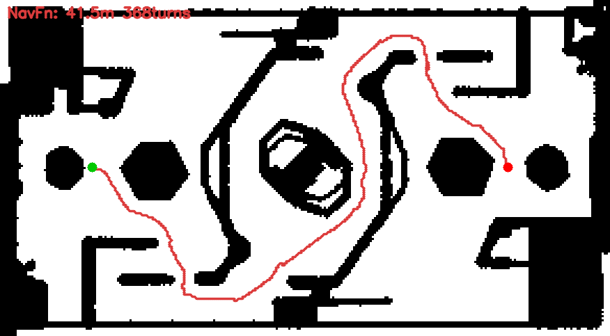

# 实验记录

> 逐次实验的原始数据与观察。报告结论见 [导航提交作业.md](导航提交作业.md)。
> 目的：留下**可复现**的测量数据，供报告引用与后续对比。

---

## 9.22 · 本地跑通静态导航栈（基线 NavFn）

### 目标

按个人日志（`blog.txt`）当天计划：**知道文件夹架构、如何运行与调参；先在本地跑通一次，看执行效果。**

### 1. 运行方式（Runbook）

```bash
# ① 构建（三个要点：bash -lc 包一层、PATH 加 /opt/cmake、用 colcon）
bash -lc 'export PATH=/opt/cmake/bin:$PATH && cd /workspaces/RMCS/rmcs_ws \
  && source /opt/ros/jazzy/setup.bash && source install/setup.bash \
  && colcon build --packages-up-to rmcs-navigation --symlink-install'

# ② 启动静态导航栈（无需 C 板、无需雷达）
bash -lc 'cd /workspaces/RMCS/rmcs_ws && source install/setup.bash \
  && ros2 launch rmcs-navigation static.launch.yaml'
```

**为什么能脱离机器人跑**：`static.launch.yaml` 用 mock 的局部地图（`empty.yaml`）+
静态 TF（`world→odom→base_link` 全为单位变换），把整个 Nav2 链路撑起来了。

#### ⚠️ 每次实验前必做：清理残留进程

导航进程极易遗留（`AGENTS.md` 明确警告）。**不清理会导致节点重复实例**，
本次就实测到了（见 §3.1）。

```bash
pkill -f 'ros2 launch rmcs-navigation'
pkill -f nav2_lifecycle_manager; pkill -f nav2_bt_navigator
pkill -f nav2_planner; pkill -f nav2_controller
pkill -f nav2_map_server; pkill -f foxglove_bridge
pkill -f static_transform_publisher
sleep 2
ps aux | grep -E 'nav2|ros2 launch' | grep -v grep | wc -l    # 应为 0
```

### 2. 环境与状态验证

| 检查项 | 命令 | 结果 |
|---|---|---|
| 节点 | `ros2 node list` | 15 个，无重复 |
| 生命周期 | `ros2 lifecycle get /<node>` | `bt_navigator` / `planner_server` / `controller_server` / `global_map` / `local_map` **全部 `active [3]`** |
| 规划器 | `ros2 param get /planner_server GridBased.plugin` | `nav2_navfn_planner::NavfnPlanner` ✅ |
| 全局地图 | 启动日志 | `Read map rmuc-v2.png: 292 X 161 map @ 0.1 m/cell` |
| 全局代价地图 | `ros2 topic echo /global_costmap/costmap` | `292 x 161 @ 0.100`，frame `world` |
| 局部代价地图 | `ros2 topic echo /local_costmap/costmap` | `400 x 400 @ 0.040`，frame `base_link`，**全 0（mock 空图）** |

### 3. 执行效果

#### 3.1 问题：节点重复实例（已解决）

首次启动时 `ros2 node list` 出现**每个节点两次**：

```
/bt_navigator        (x2)
/planner_server      (x2)
...
```

原因：上一次验证留下的孤儿进程（PID 54197/54203/54204）仍在运行，
新实例又起了一遍。同时 `foxglove_bridge` 报
`Couldn't initialize websocket server: Bind Error`（端口 8765 被占）。

**解决**：按 §1 的清理命令清空后重启 → 节点无重复，`foxglove_bridge` 正常。

> 这正是 `doc/adjustment-navigation.md` 里"远端联调必须流程化，否则会被假象误导"的实例。

#### 3.2 单次规划（`ComputePathToPose`）

起点 = 机器人当前位置 `world(0,0)`（静态 TF 固定在原点），
终点 = `world(20,0)`（需绕过场地中央的环形障碍）。

| 指标 | 实测值 |
|---|---|
| `planning_time` | **1.03 ms** |
| 路径点数 | 823 |
| 路径长度 | **41.53 m** |
| 转折点数（相邻段夹角 > 5°） | **368** |
| `error_code` | 0（成功） |

> 直线距离仅 20 m，路径却 41.53 m —— 绕中央障碍所致（对照下图）。
> **368 个转折点**是关键观察：路径是**格子级锯齿折线**，
> 局部规划器跟踪时每个转折都要调整，这正是"卡顿"的根源。



> 绿点 = 起点 `(0,0)`，红点 = 终点 `(20,0)`，红线 = NavFn 规划路径。
> 可见路径绕过中央环形障碍，且呈明显锯齿状。

#### 3.3 完整导航链路（`navigate_to_pose`）

| 话题 | 实测频率 | 配置值 | 结论 |
|---|---|---|---|
| `/plan` | **0.99 Hz** | 行为树 `RateController hz=1.0` | ✅ 稳定，无空档 |
| `/cmd_vel` | **19.9 Hz** | `controller_frequency=20.0` | ✅ 稳定 |

**结论**：规划 → 控制 → 速度指令的完整链路贯通。

> ⚠️ **静态环境的局限**：机器人不会真动（TF 是静态的），
> 所以 `navigate_to_pose` 会一直重试而不结束。该环境只能验证
> **规划链路 + 参数加载 + 规划耗时/频率**，**验证不了路径跟随质量**。

#### 3.4 代价地图统计（全局）

| 类别 | 格数 | 占比 |
|---|---|---|
| 致命（障碍） | 15799 | 33.6% |
| 膨胀区 | 16506 | 35.1% |
| 完全自由 | 14707 | 31.3% |

关键位置代价：

| 世界坐标 | 代价 | 判定 |
|---|---|---|
| 机器人起点 `(0,0)` | **89** | 膨胀区（可通行但代价高） |
| 终点 `(20,0)` | 0 | 完全自由 |
| 中央 `(10,0)` | 100 | 致命障碍 |

> ⚠️ **起点落在膨胀区（代价 89）**，说明机器人初始位置距障碍很近。
> 这与"全局 footprint 只有 0.2 m 见方、膨胀 0.5 m"的组合有关，
> 是后续调参要重点确认的点（详见报告 §3.3.4）。

### 4. 今日结论

| 项 | 结论 |
|---|---|
| 静态栈可用性 | ✅ 无需机器人即可跑通完整 Nav2 链路 |
| 基线确认 | ✅ 现用 `NavfnPlanner`，与细则表述一致 |
| 规划质量 | ⚠️ 路径 41.53 m / **368 转折** —— 锯齿折线问题实测确认 |
| 规划耗时 | 1.03 ms（单次，60×40 级地图） |
| 链路频率 | `/plan` 0.99 Hz、`/cmd_vel` 19.9 Hz，均稳定 |
| 环境坑 | 残留进程 → 节点重复 + 端口占用；**每次实验前必须清理** |

### 5. 下一步

1. 备份 NavFn 配置，切换到 `SmacPlanner2D`（见 [任务规划.md](任务规划.md) §3 阶段 3）
2. 用**同一组起终点**复测，与本记录逐项对比（转折点数预期显著下降）
3. 按 §3.3.2 的调参顺序处理 `inflation_radius` 与 footprint 不一致问题

---

## 数据文件

| 文件 | 内容 |
|---|---|
| `assets/navfn_baseline_path.png` | 基线路径可视化（地图 + 路径 + 起终点） |
| `assets/navfn_baseline_raw.txt` | `ComputePathToPose` 原始输出（含 823 个路径点） |

## 复现方法

```bash
# 复现单次规划测量
bash /tmp/bench_plan.sh 20.0 0.0 navfn_right

# 复现路径可视化
python3 /tmp/plot_path.py /tmp/path_navfn.png "NavFn:/tmp/plan_navfn_right.txt"
```

> 脚本位于 `/tmp`（临时），如需长期保留可移入本仓库 `tools/`。
