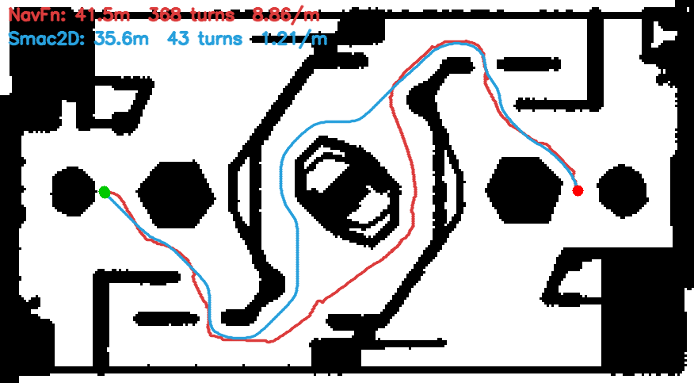

# 实验记录

> 日志化记录：**每次执行了什么、看到什么、得出什么**。
> 结论汇总见 [导航提交作业.md](导航提交作业.md)；操作方法见 [任务规划.md](任务规划.md)。
>
> 写法约定：每次实验加一节，标题为 `## 日期 时间 · 一句话主题`；
> 内部按「执行 → 结果 → 问题 → 结论」四段写，命令和数据尽量原文保留。

---

## 2026-09-22 21:05 – 21:25 · 跑通静态导航栈，取得 NavFn 基线数据

### 执行

> 📝 **命令说明**：下面记录的是当时的原始命令，都带了 `bash -lc` 和 `source` 前缀。
> 后来发现**这些前缀完全没必要** —— `.zshrc` 已自动 source 好环境
> （`~/env_setup.zsh`），`ros2`/`colcon` 直接可用。
> 简化后的写法见 [任务规划.md](任务规划.md) §2.2。此处保留原样以存真。

1. **清理残留进程**（第一次启动发现节点重复，才回头做这步）
   ```bash
   pkill -f 'ros2 launch rmcs-navigation'; sleep 2
   for p in nav2_lifecycle_manager nav2_bt_navigator nav2_planner \
            nav2_controller nav2_map_server foxglove_bridge static_transform_publisher; do
     pkill -f "$p"
   done
   sleep 2
   ps aux | grep -E 'nav2|ros2 launch|foxglove' | grep -v grep | wc -l   # → 0
   ```

2. **构建导航包及其依赖**
   ```bash
   bash -lc 'export PATH=/opt/cmake/bin:$PATH && cd /workspaces/RMCS/rmcs_ws \
     && source /opt/ros/jazzy/setup.bash && source install/setup.bash \
     && colcon build --packages-up-to rmcs-navigation --symlink-install'
   ```

3. **启动静态导航栈**（无需 C 板 / 雷达 / 定位）
   ```bash
   bash -lc 'cd /workspaces/RMCS/rmcs_ws && source install/setup.bash \
     && ros2 launch rmcs-navigation static.launch.yaml'
   ```

4. **验证节点与状态**
   ```bash
   ros2 node list
   for n in planner_server controller_server bt_navigator global_map local_map; do
     printf "%-20s %s\n" "$n" "$(ros2 lifecycle get /$n | head -1)"; done
   ros2 param get /planner_server GridBased.plugin
   ```

5. **测单次规划**（起点 = 机器人位置，终点取场地右侧需绕中央障碍）
   ```bash
   ros2 action send_goal /compute_path_to_pose nav2_msgs/action/ComputePathToPose \
     "{goal: {header: {frame_id: world}, pose: {position: {x: 20.0, y: 0.0, z: 0.0}}}, use_start: false}"
   ```

6. **测完整导航链路 + 频率**
   ```bash
   ros2 action send_goal /navigate_to_pose ... &      # 后台跑
   ros2 topic hz /plan
   ros2 topic hz /cmd_vel
   ```

7. **查代价地图**（订阅 `/global_costmap/costmap`，精确读特定坐标的代价值）

### 结果

**节点与状态**

| 检查项 | 结果 |
|---|---|
| 节点 | 15 个，无重复 |
| 生命周期 | `bt_navigator` / `planner_server` / `controller_server` / `global_map` / `local_map` **全部 `active [3]`** |
| 规划器 | `nav2_navfn_planner::NavfnPlanner` ✅ |
| 全局地图 | `Read map rmuc-v2.png: 292 X 161 map @ 0.1 m/cell` |
| 全局代价地图 | 292 × 161 @ 0.100，frame `world` |
| 局部代价地图 | 400 × 400 @ 0.040，frame `base_link`，**全 0（mock 空图）** |

**单次规划**（`ComputePathToPose`，起点 `world(0,0)` → 终点 `world(20,0)`）

| 指标 | 实测值 |
|---|---|
| `planning_time` | **1.03 ms** |
| 路径点数 | 823 |
| 路径长度 | **41.53 m** |
| 转折点数（相邻段夹角 > 5°） | **368** |
| `error_code` | 0（成功） |

> 直线距离仅 20 m，路径 41.53 m 是绕中央环形障碍所致。

**链路频率**

| 话题 | 实测 | 配置值 |
|---|---|---|
| `/plan` | **0.99 Hz** | 行为树 `RateController hz=1.0` |
| `/cmd_vel`（平均） | **19.9 Hz** | `controller_frequency=20.0` |
| `/cmd_vel`（峰值段） | ⚠️ **15.5 ~ 15.9 Hz** | 同上 |

**代价地图分布**（全局，已用修正版工具复测）

> 复测原因：`OccupancyGrid.data` 是 **`int8[]`**（有符号），而 nav2 代价是 0~254
> （无符号语义），所以 `254→-2`、`253→-3`、`255→-1`。首次读取时脚本没处理这点，
> 把 `100` 误标成"致命障碍"（真致命应是 `-2`）。现已用 [tools/costmap_probe.py](tools/costmap_probe.py) 复测。

| 类别 | 格数 | 占比 |
|---|---|---|
| 致命（254） | 0 | 0% |
| 内切（253） | 0 | 0% |
| 膨胀区（1~252） | 32305 | **68.7%** |
| **完全自由（0）** | 14707 | **31.3%** |
| 未知（255） | 0 | 0% |

**关键读数**：

| 世界坐标 | 代价 | 判定 |
|---|---|---|
| 机器人起点 `(0,0)` | 89 | 膨胀区 |
| 终点 `(20,0)` | 0 | 完全自由 |
| 场地中央 `(10,0)` | 100 | 膨胀区（首次误判为致命） |
| 左侧 `(-3,0)` | 88 | 膨胀区 |

⭐ **可用结论**：**只有 31.3% 的地图是"完全自由"**，其余 68.7% 都被膨胀覆盖。
这说明代价地图**相当保守**，规划器能用的"廉价空间"很窄
—— 直接解释了为什么路径容易贴在障碍边缘、给不出从容的走法。

**⚠️ 尚未解释的现象**（留待后续）：

1. 沿 x 轴 `y=0` 从 -4 到 +4 采样，代价几乎**恒定在 84~100**，没有梯度
   —— 而膨胀的代价必然随离障碍距离变化，均匀值不像膨胀产生的。
2. 按公式 $cost = 252 \cdot e^{-k(d - r_{in})}$ 反推：
   $k=0.5$、$r_{in}=0.1$ 时，代价 89 对应"距障碍 2.18 m"，
   但这**超过了 `inflation_radius`（0.5 m）**，逻辑上不应有代价。
3. 已用 `ros2 param get` 回读确认运行参数**确实是** `inflation_radius=0.5`、
   `cost_scaling_factor=0.5`、`resolution=0.1`、`footprint` 0.2 m 见方
   —— **不是"参数假生效"**。

> 这三条说明我对该层行为的理解还有缺口（可能涉及层内单位换算、与 static layer
> 数值的叠加方式等）。**不影响调参方向**（方向由源码公式确定，见
> [导航提交作业.md](导航提交作业.md) §2.3），但**具体数值不能凭公式硬算**，
> 要以实测为准。

**产物**

| 文件 | 内容 |
|---|---|
| `assets/navfn_baseline_path.png` | 基线路径可视化（可见锯齿） |
| `assets/navfn_baseline_raw.txt` | 原始输出，含 823 个路径点 |

### 问题

**① 节点重复实例 + 端口占用（已解决）**

首次启动 `ros2 node list` 里**每个节点出现两次**，且 `foxglove_bridge` 报：

```
Couldn't initialize websocket server: Bind Error
```

原因：上一次验证留下的孤儿进程（PID 54197 / 54203 / 54204）还在跑，
新实例又起了一遍；8765 端口被旧进程占用。

解决：按上面第 1 步清理后重启 → 节点无重复，`foxglove_bridge` 打印
`Server listening on port 8765`。

**② 控制环丢帧（待排查）**

持续导航时 `controller_server` 反复报：

```
Control loop missed its desired rate of 20.0000 Hz. Current loop rate is 15.5253 Hz.
Control loop missed its desired rate of 20.0000 Hz. Current loop rate is 15.8733 Hz.
Control loop missed its desired rate of 20.0000 Hz. Current loop rate is 15.7266 Hz.
Control loop missed its desired rate of 20.0000 Hz. Current loop rate is 15.8165 Hz.
Control loop missed its desired rate of 20.0000 Hz. Current loop rate is 15.8606 Hz.
```

配置 20 Hz，实测只有 **15.5 ~ 15.9 Hz**（缺约 21%）。

可能原因（未验证）：
1. MPPI 计算量大：`batch_size: 1400`、`time_steps: 50`、5 个 critic；
2. 容器 CPU 资源有限，无 GPU 加速；
3. `foxglove_bridge` 同时发布 49 个 channel。

> 注意：这是**局部控制器**丢帧，不是全局规划器的问题，但与"无明显卡顿"的验收直接相关。

**③ 静态环境下 `navigate_to_pose` 必然失败（预期行为，非故障）**

```
[bt_navigator]      Begin navigating from current location (0.00, 0.00) to (20.00, 0.00)
[controller_server] Received a goal, begin computing control effort.
[controller_server] Passing new path to controller.     ← 持续约 1 Hz
[controller_server] Failed to make progress            ← 4 秒后
[controller_server] [follow_path] [ActionServer] Aborting handle.
                      → 清局部 + 全局代价地图 → 重试（重复 8 次）
[bt_navigator]      Goal failed
```

原因：静态 TF 使机器人永不移动 → `SimpleProgressChecker`（`movement_time_allowance: 4.0`）
检测不到位移 → 判"无进展" → 恢复重试 → `RecoveryNode` 重试耗尽 → 失败。

解决方向：用 `tools/virtual_chassis.py` 让 `base_link` 动起来（见 [任务规划.md](任务规划.md)）。

### 结论

| 项 | 结论 |
|---|---|
| 静态栈可用性 | ✅ 无需机器人即可跑通完整 Nav2 链路 |
| 基线确认 | ✅ 现用 `NavfnPlanner`，与细则表述一致 |
| 规划质量 | ⚠️ 41.53 m / **368 转折** —— 锯齿折线实测确认 |
| 规划耗时 | 1.03 ms |
| 链路频率 | `/plan` 0.99 Hz ✅；`/cmd_vel` 峰值段丢帧至 15.8 Hz ⚠️ |
| 环境坑 | 残留进程 → 节点重复 + 端口占用；**每次实验前必须清理** |

**下一步**
1. 换 `SmacPlanner2D`，用同一组起终点复测对比转折点数
2. 用 `tools/virtual_chassis.py` 让画面动起来，在 Foxglove 里观察动态过程
3. 排查控制环丢帧：降 `batch_size`（1400 → 800）看频率是否恢复

---

## 2026-09-28 · 复核静态栈可用性，固化"静态跑一遍"流程

### 执行

隔了 6 天回来，先做一次全量健康检查，再实跑验证。

1. **环境健康检查**（构建产物 / 依赖包 / 进程 / 端口 / 环境变量）
   ```bash
   I=/workspaces/RMCS/rmcs_ws/install/rmcs-navigation
   ls $I/share/rmcs-navigation/launch/                     # 4 个 launch 文件
   ls -l $I/share/rmcs-navigation/config/motion.yaml       # 确认是软链
   for p in rmcs_executor rmcs_core rmcs_bringup rmcs_description rmcs_msgs; do
     [ -d /workspaces/RMCS/rmcs_ws/install/$p ] && echo "$p OK"; done
   ps aux | grep -E 'nav2|ros2 launch|foxglove' | grep -v grep | wc -l   # 残留进程
   netstat -tln | grep 8765
   ros2 pkg prefix rmcs-navigation                         # 环境自检
   ```

2. **实跑静态栈**
   ```bash
   cd /workspaces/RMCS/rmcs_ws
   nohup ros2 launch rmcs-navigation static.launch.yaml > /tmp/static_run.log 2>&1 &
   sleep 16   # 第一次检查（过早）
   sleep 8    # 第二次检查（24 秒）
   ```

3. **验证节点、生命周期、规划器**
   ```bash
   ros2 node list
   for n in bt_navigator planner_server controller_server global_map local_map; do
     printf "%-18s %s\n" "$n" "$(ros2 lifecycle get /$n | head -1)"; done
   ros2 param get /planner_server GridBased.plugin
   ```

4. **单次规划测试**
   ```bash
   ros2 action send_goal /compute_path_to_pose nav2_msgs/action/ComputePathToPose \
     "{goal: {header: {frame_id: world}, pose: {position: {x: 20.0, y: 0.0, z: 0.0}}}, use_start: false}"
   ```

### 结果

**环境健康检查**：全绿

| 检查项 | 结果 |
|---|---|
| `install/rmcs-navigation` | ✅ 存在，4 个 launch 文件齐全 |
| `config/motion.yaml` | ✅ 软链到源文件（改配置免编译的前提成立） |
| 依赖包（executor/core/bringup/description/msgs） | ✅ 全部 OK |
| 残留进程 / 8765 端口 | 0 个 / 空闲 |
| `ros2 pkg prefix rmcs-navigation` | ✅ 直接输出（确认无需 source） |

**启动信号**（全部出现）

```
[foxglove_bridge]   Server listening on port 8765
[map_server]        Read map rmuc-v2.png: 292 X 161 map @ 0.1 m/cell
[map_server]        Read map empty.png: 2000 X 2000 map @ 0.05 m/cell
[planner_server]    Created global planner plugin GridBased of type nav2_navfn_planner::NavfnPlanner
[lifecycle_manager] Managed nodes are active   (sensor + motion 两个都 active)
```

**节点与时序**（⚠️ 本次的新发现）

| 检查时刻 | 节点数 | planner_server | bt_navigator |
|---|---|---|---|
| 第 16 秒 | 7 个 | ❌ 未注册 | 已注册 |
| 第 24 秒 | 15 个 | ✅ 已注册 | ✅ |
| 第 24 秒生命周期 | — | `active [3]` | `active [3]` |

→ **启动到全部注册完成约需 20 秒**。过早检查会误判成"节点挂了"。

**生命周期**（复查后 5 个全 active）

```
bt_navigator       active [3]
planner_server     active [3]
controller_server  active [3]
global_map         active [3]
local_map          active [3]
```

**规划器**：`nav2_navfn_planner::NavfnPlanner`（基线未变）

**单次规划**（与 9.22 同一起终点，用于交叉验证）

| 指标 | 9.28 实测 | 9.22 实测 | 一致？ |
|---|---|---|---|
| `error_code` | 0 | 0 | ✅ |
| 状态 | `SUCCEEDED` | 成功 | ✅ |
| 路径点数 | **824** | 823（脚本另计） | ✅ 口径差 1（含 goal pose） |

> 说明基线**可复现**，后续换规划器后的对比有可靠参照。

### 问题

**① 一开始把"没等够"误判为"节点缺失"**

第 16 秒查 `ros2 node list` 只有 7 个节点，`planner_server` 不在；
`ros2 lifecycle get /planner_server` 返回 `Node not found`。
到第 24 秒复查，15 个节点齐全、生命周期正常。

**原因**：Nav2 各节点由 `lifecycle_manager` 逐个 configure + activate，
注册到 ROS 图需要时间。本次实测约 20 秒完成。

**教训**：**启动后等约 20 秒再检查**，否则会被"瞬时不完整"误导。
（同类坑：`AGENTS.md` 里也强调过导航调试要流程化，避免"假象误导"。）

**② 无其他异常**

日志里没有 `error` / `died` / `failed`（除已知的 `Error_code parameters were not set`
警告，属 Nav2 常规提示）。

### 结论

| 项 | 结论 |
|---|---|
| 环境可用性 | ✅ 隔 6 天后仍全绿，构建产物与软链都正常 |
| 静态栈 | ✅ 可稳定跑通，5 节点全 `active` |
| 基线可复现 | ✅ 824 点 / `error_code 0`，与 9.22 一致 |
| **新认知** | ⭐ **启动需等约 20 秒**才全部注册完成 |
| 流程 | ✅ "静态跑一遍"已固化进 [任务规划.md](任务规划.md) §2.7 |

**下一步**
1. 按 [任务规划.md](任务规划.md) §2.7 以自己动手的方式复跑一遍，确认流程顺手
2. 进入阶段 4：换 `SmacPlanner2D`，用同一组起终点复测，对比转折密度（基线 8.86 turns/m）

---

## 2026-09-28 · 三种规划器横向对比（NavFn / ThetaStar / Smac2D）

### 执行

对应用户 9.28 计划（"了解三种规划器 + 静态跑三种看效果"）。

1. **确认三种插件都在**
   ```bash
   ls /opt/ros/jazzy/lib/ | grep -E 'navfn|theta_star|smac'
   # libnav2_navfn_planner.so  libnav2_theta_star_planner.so
   # libnav2_smac_planner.so  libnav2_smac_planner_2d.so  libnav2_smac_planner_lattice.so
   ```

2. **备份基线配置**
   ```bash
   cp config/motion.yaml /tmp/motion.yaml.keep
   ```

3. **最小改动切换规划器**（只改 `plugin:` 一行，不加专属参数）
   ```bash
   # 换 Smac2D
   sed -i 's|nav2_navfn_planner::NavfnPlanner|nav2_smac_planner::SmacPlanner2D|' \
     rmcs_ws/src/rmcs-navigation-deps/rmcs-navigation/config/motion.yaml
   # 换 ThetaStar 同理，改成 nav2_theta_star_planner::ThetaStarPlanner
   ```

4. **各自重启 + 验证生效**
   ```bash
   ros2 launch rmcs-navigation static.launch.yaml      # 等约 20 秒
   ros2 param get /planner_server GridBased.plugin
   ros2 lifecycle get /planner_server
   ```

5. **同一起终点各跑一次规划**
   ```bash
   ros2 action send_goal /compute_path_to_pose nav2_msgs/action/ComputePathToPose \
     "{goal: {header: {frame_id: world}, pose: {position: {x: 20.0, y: 0.0, z: 0.0}}}, use_start: false}" \
     > /tmp/plan_<规划器>.txt
   ```

6. **测量路径质量**
   ```bash
   python3 tools/plot_path.py assets/compare_navfn_vs_smac2d.png \
     "NavFn:/tmp/plan_navfn_right.txt" "Smac2D:/tmp/plan_smac_default.txt"
   ```

### 结果

#### 切换可行性：✅ 三种都能只改一行就启动

| 规划器 | plugin 类名 | 仅改此行能启动？ | 生命周期 |
|---|---|---|---|
| NavFn | `nav2_navfn_planner::NavfnPlanner` | — (基线) | `active [3]` |
| ThetaStar | `nav2_theta_star_planner::ThetaStarPlanner` | ✅ | `active [3]` |
| Smac2D | `nav2_smac_planner::SmacPlanner2D` | ✅ | `active [3]` |

> **重要**：不需要加专属参数也能启动并工作（Nav2 用内置默认值）。
> 专属参数（`cost_penalty`、`smoother` 等）是**进一步调优**用的，不是启动前提。

#### 路径质量对比（同一起终点 `world(0,0)` → `(20,0)`）

| 规划器 | 点数 | 长度 | 转折数 | 转折密度 | **最大转角** | **转角总和** | **急转(>45°)** |
|---|---|---|---|---|---|---|---|
| **NavFn** | 823 | 41.53 m | 368 | 8.86 /m | **179.8°** | **18303°** | **103 次** |
| **ThetaStar** | 318 | 35.68 m | **35** | **0.98 /m** | 63.4° | 762° | 1 次 |
| **Smac2D** | 306 | **35.55 m** | 43 | 1.21 /m | **10.1°** | **282°** | **0 次** |

#### ⭐ 核心发现：转折数少 ≠ 更平滑

单看"转折数"，ThetaStar（35）**比** Smac2D（43）**还少**，容易误判 ThetaStar 更优。
但补测**转角尖锐程度**后，结论反转：

| | ThetaStar | Smac2D |
|---|---|---|
| 转折数 | 35（少） | 43（略多） |
| 最大转角 | 63.4° | **10.1°** |
| 平均转角 | 21.8° | **6.6°** |
| 转角总和 | 762° | **282°** |
| 急转(>45°) | 1 次 | **0 次** |
| 风格 | **少而尖**（硬拐弯） | **多而缓**（平滑曲线） |

**原因**：ThetaStar 用"视线检测"可走任意角度 → 直线段少但拐弯是硬的；
Smac2D 有平滑器 → 拐弯被摊成很多小角度。

**对跟踪的影响**：**急转才是顿挫的来源**。63° 的急转必须明显减速；
10° 的缓弯可以高速通过。

#### 图示



> 红线 = NavFn（41.5 m / 368 转折 / 8.86 per m）—— 明显锯齿、贴障碍、绕远
> 蓝线 = Smac2D（35.6 m / 43 转折 / 1.21 per m）—— 平滑、走通道中间、更短

### 问题

**① 三种规划器参数并不通用，但不会导致启动失败**

NavFn 的参数是 `tolerance` / `use_astar`；ThetaStar 用 `how_many_corners` /
`w_euc_cost` / `w_traversal_cost`；Smac2D 用 `cost_penalty` / `downsampling_factor` /
`smoother`。直接换 plugin 名时，不匹配的参数会被**静默忽略**，规划器用内置默认值运行。

**影响**：
- 好的一面 —— 快速横向对比很方便，一行命令就能切。
- 需要注意 —— 换规划器后**必须确认专属参数已按需设置**，否则用的是默认值而非预期值。
  建议切完用 `ros2 param list /planner_server` 看一下实际生效了哪些。

**② 本次测的是"默认参数"，不是"调优后"**

上表 Smac2D 的数据是**未加任何专属参数**的结果。加了 `cost_penalty`、
`smoother` 精调后**还有提升空间**（尤其路径还能更贴中间）。

### 结论

| 项 | 结论 |
|---|---|
| 切换成本 | ✅ 三种都只需改 `plugin:` 一行 + 重启（**不用编译**） |
| NavFn | ❌ 最大转角 179.8°、103 次急转、转角总和 18303° —— 极端锯齿，最差 |
| ThetaStar | 🔶 尚可（1 次急转），但"少而尖"，有硬拐弯 |
| **Smac2D** | ✅ **最优**：长度最短、**零急转**、转角总和仅 282°（≈NavFn 的 1/65） |
| 关键指标 | ⭐ **不能只看转折数**，要看 `max_turn` / `sum_turn` / `sharp` |

**选型结论强化**：Smac2D 胜出，且理由更精确 ——
不只是"有平滑器"，而是**实测零急转、转角总和降为 NavFn 的 1/65**。

**下一步**
1. 三种规划器都自己动手跑一遍（按 [任务规划.md](任务规划.md) §4.5）
2. 给 Smac2D 加专属参数（`cost_penalty`、`smoother`）再测，看能否进一步优化
3. 考虑把 `max_turn` / `sharp` 纳入正式验收数据

---

## 模板（后续实验照此填写）

```
## YYYY-MM-DD HH:MM – HH:MM · 一句话主题

### 执行
（命令原文）

### 结果
（数据表）

### 问题
（现象 + 原因 + 解决/待办）

### 结论
（结论 + 下一步）
```
