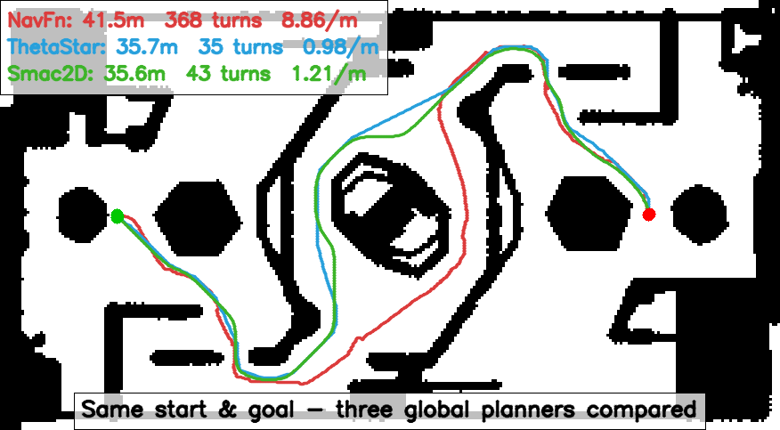

# 实验记录

> 日志化记录：**每次执行了什么、看到什么、得出什么**。
> 结论汇总见 [导航提交作业.md](导航提交作业.md)；操作方法见 [任务规划.md](任务规划.md)。
>
> 写法约定：每次实验加一节，标题为 `## 日期 时间 · 一句话主题`；
> 内部按「执行 → 结果 → 问题 → 结论」四段写，命令和数据尽量原文保留。

---

## 2026-09-22 21:05 – 21:25 · 跑通静态导航栈，取得 NavFn 基线数据

### 执行

> 📝 **命令说明**：下面记录的是当时的原始命令，都带了 `bash -lc` 和 `source` 前缀。
> 后来发现**这些前缀完全没必要** —— `.zshrc` 已自动 source 好环境
> （`~/env_setup.zsh`），`ros2`/`colcon` 直接可用。
> 简化后的写法见 [任务规划.md](任务规划.md) §2.2。此处保留原样以存真。

1. **清理残留进程**（第一次启动发现节点重复，才回头做这步）
   ```bash
   pkill -f 'ros2 launch rmcs-navigation'; sleep 2
   for p in nav2_lifecycle_manager nav2_bt_navigator nav2_planner \
            nav2_controller nav2_map_server foxglove_bridge static_transform_publisher; do
     pkill -f "$p"
   done
   sleep 2
   ps aux | grep -E 'nav2|ros2 launch|foxglove' | grep -v grep | wc -l   # → 0
   ```

2. **构建导航包及其依赖**
   ```bash
   bash -lc 'export PATH=/opt/cmake/bin:$PATH && cd /workspaces/RMCS/rmcs_ws \
     && source /opt/ros/jazzy/setup.bash && source install/setup.bash \
     && colcon build --packages-up-to rmcs-navigation --symlink-install'
   ```

3. **启动静态导航栈**（无需 C 板 / 雷达 / 定位）
   ```bash
   bash -lc 'cd /workspaces/RMCS/rmcs_ws && source install/setup.bash \
     && ros2 launch rmcs-navigation static.launch.yaml'
   ```

4. **验证节点与状态**
   ```bash
   ros2 node list
   for n in planner_server controller_server bt_navigator global_map local_map; do
     printf "%-20s %s\n" "$n" "$(ros2 lifecycle get /$n | head -1)"; done
   ros2 param get /planner_server GridBased.plugin
   ```

5. **测单次规划**（起点 = 机器人位置，终点取场地右侧需绕中央障碍）
   ```bash
   ros2 action send_goal /compute_path_to_pose nav2_msgs/action/ComputePathToPose \
     "{goal: {header: {frame_id: world}, pose: {position: {x: 20.0, y: 0.0, z: 0.0}}}, use_start: false}"
   ```

6. **测完整导航链路 + 频率**
   ```bash
   ros2 action send_goal /navigate_to_pose ... &      # 后台跑
   ros2 topic hz /plan
   ros2 topic hz /cmd_vel
   ```

7. **查代价地图**（订阅 `/global_costmap/costmap`，精确读特定坐标的代价值）

### 结果

**节点与状态**

| 检查项 | 结果 |
|---|---|
| 节点 | 15 个，无重复 |
| 生命周期 | `bt_navigator` / `planner_server` / `controller_server` / `global_map` / `local_map` **全部 `active [3]`** |
| 规划器 | `nav2_navfn_planner::NavfnPlanner` ✅ |
| 全局地图 | `Read map rmuc-v2.png: 292 X 161 map @ 0.1 m/cell` |
| 全局代价地图 | 292 × 161 @ 0.100，frame `world` |
| 局部代价地图 | 400 × 400 @ 0.040，frame `base_link`，**全 0（mock 空图）** |

**单次规划**（`ComputePathToPose`，起点 `world(0,0)` → 终点 `world(20,0)`）

| 指标 | 实测值 |
|---|---|
| `planning_time` | **1.03 ms** |
| 路径点数 | 823 |
| 路径长度 | **41.53 m** |
| 转折点数（相邻段夹角 > 5°） | **368** |
| `error_code` | 0（成功） |

> 直线距离仅 20 m，路径 41.53 m 是绕中央环形障碍所致。

**链路频率**

| 话题 | 实测 | 配置值 |
|---|---|---|
| `/plan` | **0.99 Hz** | 行为树 `RateController hz=1.0` |
| `/cmd_vel`（平均） | **19.9 Hz** | `controller_frequency=20.0` |
| `/cmd_vel`（峰值段） | ⚠️ **15.5 ~ 15.9 Hz** | 同上 |

**代价地图分布**（全局，已用修正版工具复测）

> 复测原因：`OccupancyGrid.data` 是 **`int8[]`**（有符号），而 nav2 代价是 0~254
> （无符号语义），所以 `254→-2`、`253→-3`、`255→-1`。首次读取时脚本没处理这点，
> 把 `100` 误标成"致命障碍"（真致命应是 `-2`）。现已用 [tools/costmap_probe.py](tools/costmap_probe.py) 复测。

| 类别 | 格数 | 占比 |
|---|---|---|
| 致命（254） | 0 | 0% |
| 内切（253） | 0 | 0% |
| 膨胀区（1~252） | 32305 | **68.7%** |
| **完全自由（0）** | 14707 | **31.3%** |
| 未知（255） | 0 | 0% |

**关键读数**：

| 世界坐标 | 代价 | 判定 |
|---|---|---|
| 机器人起点 `(0,0)` | 89 | 膨胀区 |
| 终点 `(20,0)` | 0 | 完全自由 |
| 场地中央 `(10,0)` | 100 | 膨胀区（首次误判为致命） |
| 左侧 `(-3,0)` | 88 | 膨胀区 |

⭐ **可用结论**：**只有 31.3% 的地图是"完全自由"**，其余 68.7% 都被膨胀覆盖。
这说明代价地图**相当保守**，规划器能用的"廉价空间"很窄
—— 直接解释了为什么路径容易贴在障碍边缘、给不出从容的走法。

**⚠️ 尚未解释的现象**（留待后续）：

1. 沿 x 轴 `y=0` 从 -4 到 +4 采样，代价几乎**恒定在 84~100**，没有梯度
   —— 而膨胀的代价必然随离障碍距离变化，均匀值不像膨胀产生的。
2. 按公式 $cost = 252 \cdot e^{-k(d - r_{in})}$ 反推：
   $k=0.5$、$r_{in}=0.1$ 时，代价 89 对应"距障碍 2.18 m"，
   但这**超过了 `inflation_radius`（0.5 m）**，逻辑上不应有代价。
3. 已用 `ros2 param get` 回读确认运行参数**确实是** `inflation_radius=0.5`、
   `cost_scaling_factor=0.5`、`resolution=0.1`、`footprint` 0.2 m 见方
   —— **不是"参数假生效"**。

> 这三条说明我对该层行为的理解还有缺口（可能涉及层内单位换算、与 static layer
> 数值的叠加方式等）。**不影响调参方向**（方向由源码公式确定，见
> [导航提交作业.md](导航提交作业.md) §2.3），但**具体数值不能凭公式硬算**，
> 要以实测为准。

**产物**

| 文件 | 内容 |
|---|---|
| `assets/navfn_baseline_path.png` | 基线路径可视化（可见锯齿） |
| `assets/navfn_baseline_raw.txt` | 原始输出，含 823 个路径点 |

> 后续 9.28 又补了统一风格的演示套图：`assets/path_navfn.png`、
> `path_theta_star.png`、`path_smac2d.png`、`path_compare_three.png`（见下 9.28 节）。

### 问题

**① 节点重复实例 + 端口占用（已解决）**

首次启动 `ros2 node list` 里**每个节点出现两次**，且 `foxglove_bridge` 报：

```
Couldn't initialize websocket server: Bind Error
```

原因：上一次验证留下的孤儿进程（PID 54197 / 54203 / 54204）还在跑，
新实例又起了一遍；8765 端口被旧进程占用。

解决：按上面第 1 步清理后重启 → 节点无重复，`foxglove_bridge` 打印
`Server listening on port 8765`。

**② 控制环丢帧（待排查）**

持续导航时 `controller_server` 反复报：

```
Control loop missed its desired rate of 20.0000 Hz. Current loop rate is 15.5253 Hz.
Control loop missed its desired rate of 20.0000 Hz. Current loop rate is 15.8733 Hz.
Control loop missed its desired rate of 20.0000 Hz. Current loop rate is 15.7266 Hz.
Control loop missed its desired rate of 20.0000 Hz. Current loop rate is 15.8165 Hz.
Control loop missed its desired rate of 20.0000 Hz. Current loop rate is 15.8606 Hz.
```

配置 20 Hz，实测只有 **15.5 ~ 15.9 Hz**（缺约 21%）。

可能原因（未验证）：
1. MPPI 计算量大：`batch_size: 1400`、`time_steps: 50`、5 个 critic；
2. 容器 CPU 资源有限，无 GPU 加速；
3. `foxglove_bridge` 同时发布 49 个 channel。

> 注意：这是**局部控制器**丢帧，不是全局规划器的问题，但与"无明显卡顿"的验收直接相关。

**③ 静态环境下 `navigate_to_pose` 必然失败（预期行为，非故障）**

```
[bt_navigator]      Begin navigating from current location (0.00, 0.00) to (20.00, 0.00)
[controller_server] Received a goal, begin computing control effort.
[controller_server] Passing new path to controller.     ← 持续约 1 Hz
[controller_server] Failed to make progress            ← 4 秒后
[controller_server] [follow_path] [ActionServer] Aborting handle.
                      → 清局部 + 全局代价地图 → 重试（重复 8 次）
[bt_navigator]      Goal failed
```

原因：静态 TF 使机器人永不移动 → `SimpleProgressChecker`（`movement_time_allowance: 4.0`）
检测不到位移 → 判"无进展" → 恢复重试 → `RecoveryNode` 重试耗尽 → 失败。

解决方向：用 `tools/virtual_chassis.py` 让 `base_link` 动起来（见 [任务规划.md](任务规划.md)）。

### 结论

| 项 | 结论 |
|---|---|
| 静态栈可用性 | ✅ 无需机器人即可跑通完整 Nav2 链路 |
| 基线确认 | ✅ 现用 `NavfnPlanner`，与细则表述一致 |
| 规划质量 | ⚠️ 41.53 m / **368 转折** —— 锯齿折线实测确认 |
| 规划耗时 | 1.03 ms |
| 链路频率 | `/plan` 0.99 Hz ✅；`/cmd_vel` 峰值段丢帧至 15.8 Hz ⚠️ |
| 环境坑 | 残留进程 → 节点重复 + 端口占用；**每次实验前必须清理** |

**下一步**
1. 换 `SmacPlanner2D`，用同一组起终点复测对比转折点数
2. 用 `tools/virtual_chassis.py` 让画面动起来，在 Foxglove 里观察动态过程
3. 排查控制环丢帧：降 `batch_size`（1400 → 800）看频率是否恢复

---

## 2026-09-28 · 复核静态栈可用性，固化"静态跑一遍"流程

### 执行

隔了 6 天回来，先做一次全量健康检查，再实跑验证。

1. **环境健康检查**（构建产物 / 依赖包 / 进程 / 端口 / 环境变量）
   ```bash
   I=/workspaces/RMCS/rmcs_ws/install/rmcs-navigation
   ls $I/share/rmcs-navigation/launch/                     # 4 个 launch 文件
   ls -l $I/share/rmcs-navigation/config/motion.yaml       # 确认是软链
   for p in rmcs_executor rmcs_core rmcs_bringup rmcs_description rmcs_msgs; do
     [ -d /workspaces/RMCS/rmcs_ws/install/$p ] && echo "$p OK"; done
   ps aux | grep -E 'nav2|ros2 launch|foxglove' | grep -v grep | wc -l   # 残留进程
   netstat -tln | grep 8765
   ros2 pkg prefix rmcs-navigation                         # 环境自检
   ```

2. **实跑静态栈**
   ```bash
   cd /workspaces/RMCS/rmcs_ws
   nohup ros2 launch rmcs-navigation static.launch.yaml > /tmp/static_run.log 2>&1 &
   sleep 16   # 第一次检查（过早）
   sleep 8    # 第二次检查（24 秒）
   ```

3. **验证节点、生命周期、规划器**
   ```bash
   ros2 node list
   for n in bt_navigator planner_server controller_server global_map local_map; do
     printf "%-18s %s\n" "$n" "$(ros2 lifecycle get /$n | head -1)"; done
   ros2 param get /planner_server GridBased.plugin
   ```

4. **单次规划测试**
   ```bash
   ros2 action send_goal /compute_path_to_pose nav2_msgs/action/ComputePathToPose \
     "{goal: {header: {frame_id: world}, pose: {position: {x: 20.0, y: 0.0, z: 0.0}}}, use_start: false}"
   ```

### 结果

**环境健康检查**：全绿

| 检查项 | 结果 |
|---|---|
| `install/rmcs-navigation` | ✅ 存在，4 个 launch 文件齐全 |
| `config/motion.yaml` | ✅ 软链到源文件（改配置免编译的前提成立） |
| 依赖包（executor/core/bringup/description/msgs） | ✅ 全部 OK |
| 残留进程 / 8765 端口 | 0 个 / 空闲 |
| `ros2 pkg prefix rmcs-navigation` | ✅ 直接输出（确认无需 source） |

**启动信号**（全部出现）

```
[foxglove_bridge]   Server listening on port 8765
[map_server]        Read map rmuc-v2.png: 292 X 161 map @ 0.1 m/cell
[map_server]        Read map empty.png: 2000 X 2000 map @ 0.05 m/cell
[planner_server]    Created global planner plugin GridBased of type nav2_navfn_planner::NavfnPlanner
[lifecycle_manager] Managed nodes are active   (sensor + motion 两个都 active)
```

**节点与时序**（⚠️ 本次的新发现）

| 检查时刻 | 节点数 | planner_server | bt_navigator |
|---|---|---|---|
| 第 16 秒 | 7 个 | ❌ 未注册 | 已注册 |
| 第 24 秒 | 15 个 | ✅ 已注册 | ✅ |
| 第 24 秒生命周期 | — | `active [3]` | `active [3]` |

→ **启动到全部注册完成约需 20 秒**。过早检查会误判成"节点挂了"。

**生命周期**（复查后 5 个全 active）

```
bt_navigator       active [3]
planner_server     active [3]
controller_server  active [3]
global_map         active [3]
local_map          active [3]
```

**规划器**：`nav2_navfn_planner::NavfnPlanner`（基线未变）

**单次规划**（与 9.22 同一起终点，用于交叉验证）

| 指标 | 9.28 实测 | 9.22 实测 | 一致？ |
|---|---|---|---|
| `error_code` | 0 | 0 | ✅ |
| 状态 | `SUCCEEDED` | 成功 | ✅ |
| 路径点数 | **824** | 823（脚本另计） | ✅ 口径差 1（含 goal pose） |

> 说明基线**可复现**，后续换规划器后的对比有可靠参照。

### 问题

**① 一开始把"没等够"误判为"节点缺失"**

第 16 秒查 `ros2 node list` 只有 7 个节点，`planner_server` 不在；
`ros2 lifecycle get /planner_server` 返回 `Node not found`。
到第 24 秒复查，15 个节点齐全、生命周期正常。

**原因**：Nav2 各节点由 `lifecycle_manager` 逐个 configure + activate，
注册到 ROS 图需要时间。本次实测约 20 秒完成。

**教训**：**启动后等约 20 秒再检查**，否则会被"瞬时不完整"误导。
（同类坑：`AGENTS.md` 里也强调过导航调试要流程化，避免"假象误导"。）

**② 无其他异常**

日志里没有 `error` / `died` / `failed`（除已知的 `Error_code parameters were not set`
警告，属 Nav2 常规提示）。

### 结论

| 项 | 结论 |
|---|---|
| 环境可用性 | ✅ 隔 6 天后仍全绿，构建产物与软链都正常 |
| 静态栈 | ✅ 可稳定跑通，5 节点全 `active` |
| 基线可复现 | ✅ 824 点 / `error_code 0`，与 9.22 一致 |
| **新认知** | ⭐ **启动需等约 20 秒**才全部注册完成 |
| 流程 | ✅ "静态跑一遍"已固化进 [任务规划.md](任务规划.md) §2.7 |

**下一步**
1. 按 [任务规划.md](任务规划.md) §2.7 以自己动手的方式复跑一遍，确认流程顺手
2. 进入阶段 4：换 `SmacPlanner2D`，用同一组起终点复测，对比转折密度（基线 8.86 turns/m）

---

## 2026-09-28 · 三种规划器横向对比（NavFn / ThetaStar / Smac2D）

### 执行

对应用户 9.28 计划（"了解三种规划器 + 静态跑三种看效果"）。

1. **确认三种插件都在**
   ```bash
   ls /opt/ros/jazzy/lib/ | grep -E 'navfn|theta_star|smac'
   # libnav2_navfn_planner.so  libnav2_theta_star_planner.so
   # libnav2_smac_planner.so  libnav2_smac_planner_2d.so  libnav2_smac_planner_lattice.so
   ```

2. **备份基线配置**
   ```bash
   cp config/motion.yaml /tmp/motion.yaml.keep
   ```

3. **最小改动切换规划器**（只改 `plugin:` 一行，不加专属参数）
   ```bash
   # 换 Smac2D
   sed -i 's|nav2_navfn_planner::NavfnPlanner|nav2_smac_planner::SmacPlanner2D|' \
     rmcs_ws/src/rmcs-navigation-deps/rmcs-navigation/config/motion.yaml
   # 换 ThetaStar 同理，改成 nav2_theta_star_planner::ThetaStarPlanner
   ```

4. **各自重启 + 验证生效**
   ```bash
   ros2 launch rmcs-navigation static.launch.yaml      # 等约 20 秒
   ros2 param get /planner_server GridBased.plugin
   ros2 lifecycle get /planner_server
   ```

5. **同一起终点各跑一次规划**
   ```bash
   ros2 action send_goal /compute_path_to_pose nav2_msgs/action/ComputePathToPose \
     "{goal: {header: {frame_id: world}, pose: {position: {x: 20.0, y: 0.0, z: 0.0}}}, use_start: false}" \
     > /tmp/plan_<规划器>.txt
   ```

6. **测量路径质量**
   ```bash
   python3 tools/plot_path.py assets/path_compare_three.png \
     --title "Same start & goal - three global planners compared" \
     "NavFn:/tmp/plan_navfn_right.txt" \
     "ThetaStar:/tmp/plan_theta.txt" \
     "Smac2D:/tmp/plan_smac_default.txt"
   ```

### 结果

#### 切换可行性：✅ 三种都能只改一行就启动

| 规划器 | plugin 类名 | 仅改此行能启动？ | 生命周期 |
|---|---|---|---|
| NavFn | `nav2_navfn_planner::NavfnPlanner` | — (基线) | `active [3]` |
| ThetaStar | `nav2_theta_star_planner::ThetaStarPlanner` | ✅ | `active [3]` |
| Smac2D | `nav2_smac_planner::SmacPlanner2D` | ✅ | `active [3]` |

> **重要**：不需要加专属参数也能启动并工作（Nav2 用内置默认值）。
> 专属参数（`cost_penalty`、`smoother` 等）是**进一步调优**用的，不是启动前提。

#### 路径质量对比（同一起终点 `world(0,0)` → `(20,0)`）

| 规划器 | 点数 | 长度 | 转折数 | 转折密度 | **最大转角** | **转角总和** | **急转(>45°)** |
|---|---|---|---|---|---|---|---|
| **NavFn** | 823 | 41.53 m | 368 | 8.86 /m | **179.8°** | **18303°** | **103 次** |
| **ThetaStar** | 318 | 35.68 m | **35** | **0.98 /m** | 63.4° | 762° | 1 次 |
| **Smac2D** | 306 | **35.55 m** | 43 | 1.21 /m | **10.1°** | **282°** | **0 次** |

#### ⭐ 核心发现：转折数少 ≠ 更平滑

单看"转折数"，ThetaStar（35）**比** Smac2D（43）**还少**，容易误判 ThetaStar 更优。
但补测**转角尖锐程度**后，结论反转：

| | ThetaStar | Smac2D |
|---|---|---|
| 转折数 | 35（少） | 43（略多） |
| 最大转角 | 63.4° | **10.1°** |
| 平均转角 | 21.8° | **6.6°** |
| 转角总和 | 762° | **282°** |
| 急转(>45°) | 1 次 | **0 次** |
| 风格 | **少而尖**（硬拐弯） | **多而缓**（平滑曲线） |

**原因**：ThetaStar 用"视线检测"可走任意角度 → 直线段少但拐弯是硬的；
Smac2D 有平滑器 → 拐弯被摊成很多小角度。

**对跟踪的影响**：**急转才是顿挫的来源**。63° 的急转必须明显减速；
10° 的缓弯可以高速通过。

#### 图示

**汇总图**（同一组起终点叠画）：



> 红线 = NavFn（41.5 m / 368 转折 / 8.86 per m）—— 明显锯齿、贴障碍、绕远
> 蓝线 = ThetaStar（35.7 m / 35 转折 / 0.98 per m）—— 段少但拐得硬
> 绿线 = Smac2D（35.6 m / 43 转折 / 1.21 per m）—— 平滑、走通道中间、最短

**单规划器大图**（看不清细节时看这三张）：

| 规划器 | 图 |
|---|---|
| NavFn | `assets/path_navfn.png` |
| ThetaStar | `assets/path_theta_star.png` |
| Smac2D | `assets/path_smac2d.png` |

### 问题

**① 三种规划器参数并不通用，但不会导致启动失败**

NavFn 的参数是 `tolerance` / `use_astar`；ThetaStar 用 `how_many_corners` /
`w_euc_cost` / `w_traversal_cost`；Smac2D 用 `cost_penalty` / `downsampling_factor` /
`smoother`。直接换 plugin 名时，不匹配的参数会被**静默忽略**，规划器用内置默认值运行。

**影响**：
- 好的一面 —— 快速横向对比很方便，一行命令就能切。
- 需要注意 —— 换规划器后**必须确认专属参数已按需设置**，否则用的是默认值而非预期值。
  建议切完用 `ros2 param list /planner_server` 看一下实际生效了哪些。

**② 本次测的是"默认参数"，不是"调优后"**

上表 Smac2D 的数据是**未加任何专属参数**的结果。加了 `cost_penalty`、
`smoother` 精调后**还有提升空间**（尤其路径还能更贴中间）。

### 结论

| 项 | 结论 |
|---|---|
| 切换成本 | ✅ 三种都只需改 `plugin:` 一行 + 重启（**不用编译**） |
| NavFn | ❌ 最大转角 179.8°、103 次急转、转角总和 18303° —— 极端锯齿，最差 |
| ThetaStar | 🔶 尚可（1 次急转），但"少而尖"，有硬拐弯 |
| **Smac2D** | ✅ **最优**：长度最短、**零急转**、转角总和仅 282°（≈NavFn 的 1/65） |
| 关键指标 | ⭐ **不能只看转折数**，要看 `max_turn` / `sum_turn` / `sharp` |

**选型结论强化**：Smac2D 胜出，且理由更精确 ——
不只是"有平滑器"，而是**实测零急转、转角总和降为 NavFn 的 1/65**。

**下一步**
1. 三种规划器都自己动手跑一遍（按 [任务规划.md](任务规划.md) §4.5）
2. 给 Smac2D 加专属参数（`cost_penalty`、`smoother`）再测，看能否进一步优化
3. 考虑把 `max_turn` / `sharp` 纳入正式验收数据

---

## 2026-09-28 · 摸清真车上车链路：只改 motion.yaml，但有"三道隐藏门"

### 执行

1. **认清链路**：读 `.script/` 下全部脚本（`ssh-remote` / `sync-remote` / `wait-sync` /
   `attach-remote` / `set-robot` / `rmcs-cli`），理清"本地编译 → unison 同步 → 远端重启"
   的**远程部署**模型。
2. **找 SOP**：`AGENTS.md` 明确导航调参闭环 = **仅修改 `rmcs-navigation/config/motion.yaml`**
   → `wait-sync` → 重启 → `ros2 param get` 回读 → 实车验证。
3. **追"导航何时启动"**：读 `src/lua/api.lua` 的 `restart_navigation()` 与 `src/lua/endpoint/*.lua`。
4. **追"底盘何时接受导航速度"**：读 `rmcs_core/.../chassis_controller.cpp`
   与 `navigation.cc` 的 `/cmd_vel` 订阅。
5. **对比官方分支**：扫 `Alliance-Algorithm/rmcs-navigation` 全部分支的 `config/` 改动，
   找现成的调参参考。

### 结果

**① 链路是"远程部署"，不是"远程遥控"**
```
build-rmcs → sync-remote(unison) → ssh://remote//rmcs_install → service rmcs restart
```
`~/.ssh/config`：`remote` = `127.0.0.1:2022`，user `root`。**第一道门就是端口**。

**② 真车上只需改一个文件**
`rmcs-navigation/config/motion.yaml`。`sentry.yaml` 里导航**已是启用状态**
（`- rmcs::navigation::Navigation -> rmcs_navigation`），`endpoint: "rmuc"` 也配好了。

**③ 三道隐藏门（不搞清车不动）**

| 门 | 位置 | 机制 |
|---|---|---|
| 1 · 导航由**比赛阶段**触发 | `rmuc.lua:122` | `PREPARATION → 下一阶段` 才 `restart_navigation{}`，用 tmux 起 `motion`+`sensor` |
| 2 · 底盘使能 = **遥控器右拨杆 UP** | `rmuc.lua:27` | `update_enable_control(rswitch == "UP")`；否则 `chassis_controller` 走遥控器分支，**车一步不动但 `/plan` 照常输出** |
| 3 · `global_map` 由 **Lua 端点**决定 | `rmuc.lua:125` | `sensor.launch.yaml` 默认是 `empty`（空图！）；`rmuc.lua` 写死 `"rmuc"` ✅ |

**④ 官方分支里有现成的调参参考**

| 分支 | 日期 | ±main | 全局规划器 | 价值 |
|---|---|---|---|---|
| `dev/tcd-test` | **2026-09-22** | +7/−0 | `NavfnPlanner` | **保留 NavFn 调 MPPI**：`PathAlignCritic` 0.8→**4.5**、`PathFollowCritic` 3.2→**2.4**、`batch_size` 1400→2000、`prune_distance` 6→4.5、`inflation_radius` 0.5→0.22/0.34 |
| `feature/competition-navigation-20260423` | 2026-04-23 | +2/−41 | **`SmacPlanner2D`** | **换 Smac2D 的完整参数**：`tolerance` 0.25、`cost_travel_multiplier` 6.0、`max_planning_time` 0.2、footprint **0.2475**、`controller_frequency` 30 |

> ⭐ 两个独立来源都指向同一件事：**`PathAlignCritic` 是消卡顿的关键**。
> 且官方竞赛分支**已经选过 `SmacPlanner2D`** —— 我们的选型有先例。

**⑤ 顺带查出的两个遗留 bug**
- `global_costmap` footprint 是 `0.2` 方、`local_costmap` 是 `0.495` 方 —— **不一致**
- `global_costmap` 没有障碍层（只有 `static_layer + inflation_layer`）

### 问题

**① 远端当前不可达**
```
端口 127.0.0.1:2022  →  ❌ 不通
```
真车没开机，或者端口转发没起。**这是上真车的第一道门**，不通则后续全部无意义。

**② `RMCS_ROBOT_TYPE` 是空字符串**
`~/env_setup.bash` 里 `export RMCS_ROBOT_TYPE=""`，不 `set-robot sentry` 的话 `launch-rmcs` 会直接报错。

**③ 静态环境测不出"门 2"**
`static.launch.yaml` 里根本没有 `rmcs_executor`，`/cmd_vel` 无人订阅 ——
所以静态环境永远看不到"底盘使能"这一层。

### 结论

1. **上真车的工作量比预想小**：只改 `motion.yaml` 一个文件，**一行 C++ 都不用动**。
2. **但门槛在"非代码"的地方**：端口连通、`set-robot`、比赛阶段触发、遥控器拨杆 ——
   这四个不解决，代码再对车也不动。
3. **调试时要区分"没规划"和"不动"**：`/plan` 有输出但车不动 → 先查 `enable_control`
   （遥控器拨杆），而不是去查规划器。
4. `feature/competition-navigation-20260423` 的 Smac2D 参数 + `dev/tcd-test` 的 MPPI 调参
   —— 两套可以直接作为**落盘基线**，不用从零试。

---

## 2026-09-28 21:40 – 23:15 · 实车接 Foxglove 的三层排查：连不上 / 地图不出 / 导航起不来

### 执行

1. **确认机器人地址**：`last -i` 查机器人上的登录记录
2. **扫网段**：`scan-remote`（默认扫 `192.168.{1..5}.0/24`）
3. **测 8765 端口连通性**：`bash -c "cat < /dev/null > /dev/tcp/<ip>/8765"`
4. **查 Foxglove 官方文档**：Map panel / 3D panel 各自支持哪些报文
5. **追依赖链**：读 `sensor.launch.yaml`、`static.launch.yaml` 的全部 `include`
6. **查包是否存在**：`ros2 pkg prefix <pkg>`、对比本地 `install/` 与机器人 `/rmcs_install/`
7. **起导航栈**：在 tmux 会话 `navigation` 中跑 `static.launch.yaml`
8. **试启用 `TfBroadcaster`** → 崩溃 → 回滚

### 结果

**① 机器人地址**

```
192.168.3.27      wlp3s0（WiFi）   ← remote 用这个
192.168.100.1     enp2s0（有线）
172.17.0.1        docker0
```

`scan-remote` 在 `192.168.3.0/24` 找到 2 台：`192.168.3.27` = **alliance-sentry**、
`192.168.3.208` = alliance-wheel-leg（**不是哨兵，别选错**）。

**② Foxglove 三个"不是 bug 的坑"**

| 现象 | 真因 |
|---|---|
| 连不上 | 地址填了 `localhost`（= 自己电脑）。bridge 跑在机器人上 |
| 「地图」面板永远"正在等待消息" | Foxglove **Map 面板只支持 `NavSatFix` 和 `GeoJSON`**（都是地理坐标），**不支持 `OccupancyGrid`**。看 ROS 地图必须用 **3D 面板** |
| 3D 面板只有一片蓝色网格 | 那是面板自带的参考网格。**必须在「主题」里手动勾上 `/map`**，Foxglove 不会自动加载话题 |

**3D 面板支持的导航相关报文**（官方文档）：

| 报文 | 用途 |
|---|---|
| `nav_msgs/msg/OccupancyGrid` | `/map`、costmap（有 `Costmap` 配色预设） |
| `map_msgs/msg/OccupancyGridUpdate` | 增量代价图更新（自动按 `_updates` 后缀配对） |
| `nav_msgs/msg/Path` | `/plan` |
| `tf2_msgs/msg/TFMessage` | `/tf`、`/tf_static` |

**③ `TfBroadcaster` 不能启用（会崩）**

启用后 `rmcs_executor` 直接 SIGABRT 崩溃循环（exit code −6）：

```
sentry_hardware 声明的输出类型：
  JointCollection<GimbalCenterLink, BottomYawLink, TopYawLink, PitchLink,
                  TransmitterLink, CameraLink, OdomImu, OdomGimbalImu,
                  LeftFrontWheelLink, LeftBackWheelLink, RightBackWheelLink,
                  RightFrontWheelLink>
tf_broadcaster 请求的输入类型：
  JointCollection<GimbalCenterLink, YawLink, PitchLink, TransmitterLink,
                  CameraLink, OdomImu, LeftFrontWheelLink, LeftBackWheelLink,
                  RightBackWheelLink, RightFrontWheelLink, ViewerLink>
```

根因：`tf_broadcaster.cpp` 用**通用** `rmcs_description/tf_description.hpp`，
而 sentry 用 `sentry_description.hpp`（偏心双 yaw，多 `BottomYawLink`/`TopYawLink`、少 `ViewerLink`）。
**这就是官方所有 sentry 分支都把它注释掉的原因 —— 不是忘了，是不能用。**

**④ 导航起不来的真正原因：`rmcs_localization` 从未被构建**

`sensor.launch.yaml` 第 98 行：

```yaml
- include:
    file: "$(find-pkg-share rmcs_localization)/launch/launch.py"
```

它是该文件里**唯一一个没有任何 `if` 守卫的 include** —— 其余四个都带 `if: launch_livox` / `if: launch_odin1`：

```yaml
- include: { if: launch_odin1,  file: .../odin_ros_driver/... }
- include: { if: launch_livox,  file: .../livox_ros_driver2/... }
- include: { if: launch_livox,  file: .../rmcs_local_map/... }
- include: { if: launch_livox,  file: .../point_lio/... }
- include: {                   file: .../rmcs_localization/... }   ← 无守卫
```

验证：

```
ros2 pkg prefix rmcs_localization   →  Package not found
本地 install/：无   本地 build/：无   机器人 /rmcs_install/：无
```

雪上加霜的是 `static_transform_publisher` 那条带 `unless: launch_livox`：

```yaml
- tf2_ros/static_transform_publisher  args: "0 0 0 0 0 0 world odom"        # 无条件
- tf2_ros/static_transform_publisher  args: "0 0 0 0 0 0 odom base_link"   # unless: launch_livox
```

游戏阶段触发时 `launch_livox=true` → 静态 `odom→base_link` 被跳过 →
本该由 **`point_lio`** 接上（它才是 `odom→base_link` 的正主）。

包一缺 → `find-pkg-share` 失败 → launch 直接退出 → 无 TF、无 costmap、无 `/plan`。

> ⚠️ **勘误（2026-09-29）**：此处原文写的是「`rmcs_localization` 成了 `odom→base_link`
> 的唯一来源」——**这是错的**。它的 `README.md` 写明输出的是静态 **`world -> odom`**，
> 且「**不依赖 `base_link` 的 TF 输入**」。`odom→base_link` 由 `point_lio` 发布。
> 详见 2026-09-29 条目。

**⑤ 绕过办法：`static.launch.yaml`**

官方注释写明它是「纯软件联调的最小启动环境，**在没有任何真实传感器、里程计或 SLAM 输出时，
验证导航链路本身是否能正常启动**」，自带 `world→odom` 与 `odom→base_link` 两个静态 TF，
不 include `rmcs_localization`。

起栈后实测：

```
topic 数 8 → 52
lifecycle: bt_navigator / planner_server / controller_server / global_map  全 active [3]

/tf_static   2 个发布者：world → odom、odom → base_link
/map                    nav_msgs/msg/OccupancyGrid   frame_id=world  343×110
/global_costmap/costmap nav_msgs/msg/OccupancyGrid   frame_id=world  343×110
/local_costmap/costmap  nav_msgs/msg/OccupancyGrid
/plan                   nav_msgs/msg/Path

/planner_server    GridBased.plugin   = nav2_smac_planner::SmacPlanner2D
/controller_server FollowPath.plugin  = nav2_mppi_controller::MPPIController
```

`343×110` 正是 `战队.png` 的尺寸 → **换规划器与地图切换均已在实车验证生效**。

**⑥ 监听哨兵的命令：`remote-status`**

它调机器人上的 `/rmcs/service/robot_status` 服务并格式化输出。实测哨兵**硬件全在线**：

```
GimbalBoard:  Can3 | 0x142 | 0x141 |   Imu | Acc | Gyr |   Can0 | 0x202 | 0x204 | 0x201 |
ChassisBoard: Uart0 | Active |   Dbus | Active |   Imu | Acc | Gyr |
              Can0 | 0x143 | 0x142 |   Can1 | 0x205 | 0x202 | 0x201 | 0x206 |
              Can2 | 0x205 | 0x204 | 0x206 | 0x202 |   Can3 | 0x141 | 0x202 | 0x201 | 0x300 |
```

**⑦ `foxglove` 命令被遮蔽**

```
type -a foxglove
  foxglove is /usr/local/bin/foxglove            ← 实际执行的是它
  foxglove is /workspaces/RMCS/.script/foxglove  ← 被遮蔽
```

`env_setup.zsh` 用 `export PATH="${PATH}:${RMCS_PATH}/.script"` **追加到末尾**，
而 `/usr/local/bin` 排在前面。`/usr/local/bin/foxglove` 是
**Foxglove 数据平台 CLI**（Go 二进制，18.8 MB，非 dpkg 安装，
`--help` 自称 "Command line client for the Foxglove data platform"），
与 `foxglove_bridge` 完全无关。

要跑那个脚本必须显式：`./.script/foxglove`。

⚠️ **`.script/` 下只有 `foxglove` 一个撞名**，其余（`remote-status`、`sync-remote`、
`attach-remote`…）都能直接敲裸名。

**⑧ 导航栈的规范管理方式**

`AGENTS.md` §2.1/§2.C 规定用 **tmux 会话 `navigation`**，不要用 `nohup`
（`nohup` 起的进程扛不住会话结束，实测几分钟后就没了）：

```bash
ssh-remote "bash -lc 'tmux capture-pane -t navigation -p -S -120'"
```

### 问题

**① 我把机器人搞崩过一次**

误判「`TfBroadcaster` 该启用」，导致 `rmcs_executor` SIGABRT 崩溃循环。
处理：回滚配置 → `scp` 单文件推送 → `service rmcs stop/start` → 确认 etime 单调递增
无重启、日志 ERROR 0 行、组件统计 `sentry_hardware_command 64.6% / rmcs_navigation 11.7%`。

**教训**：改 `sentry.yaml` 的 `components` 列表前，**先核对组件声明的接口类型是否与
硬件组件匹配**。类型不匹配是**加载期崩溃**，不是运行期报错。

**② `remote-status` 报的零点与 `sentry.yaml` 不一致**

| 参数 | `sentry.yaml` | 机器人实际报 | 差异 |
|---|---|---|---|
| `bottom_yaw_motor_zero_point` | 54253 | **50121** | 4132 |
| `pitch_motor_zero_point` | 12453 | **12484** | 31 |
| `top_yaw_motor_zero_point` | 32736 | 32736 | ✅ 一致 |

待确认：是重新标定后配置没同步，还是该 service 报的是运行时值、yaml 只是启动默认值。
**建议找云台标定负责人核对。**

**③ `static.launch.yaml` 的定位是假的**

`world→odom`、`odom→base_link` 都是恒等静态变换，没有任何真实定位。
它算出的路径与位姿**全是错的**，会照着假位姿发 `/cmd_vel`。
**动车前必须把车架空**，或确认场地安全、遥控器随时能接管。

**④ 本节之前那条记录里的 `remote = 127.0.0.1:2022` 已过时**

现为 `192.168.3.27:2022`。`~/.ssh/config` 实测：

```ssh-config
Host remote
    HostName 192.168.3.27
    Port 2022
    User root
    IdentityFile ~/.ssh/id_rsa
```

（按"原文存真"约定，未改动那条旧记录，在此更正。）

### 结论

1. **Foxglove 侧只需三步**：地址填 `ws://192.168.3.27:8765` → 用 **Desktop 版**
   （网页版是 https 页面，连 `ws://` 会被浏览器按 mixed-content 拦掉）→
   加 **3D 面板** → 在「主题」里手动勾 `/map`。
2. **实车导航卡住是"缺包"，不是"参数不对"** —— `rmcs_localization` 从未构建，
   而 `sensor.launch.yaml` 硬依赖它。**这是项目级缺口，建议上报组长**：
   要么补构建，要么把入口改成 `static.launch.yaml`。
3. **`TfBroadcaster` 与 sentry 的 TF 树类型不兼容**，不要再尝试启用。
   建议在 `sentry.yaml` 里加一行注释说明，免得下一个人重蹈覆辙。
4. **`SmacPlanner2D` 已在实车验证生效**，换规划器这条要求已达成。
5. **下一步**：用 `static.launch.yaml` 发导航目标（**车架空**），
   跑通"随便点两个点能到"；随后补 `rmcs_localization` 才能上真场地。（→ **已于 2026-09-29 补编译完成**，见下一条）

---

## 2026-09-29 · 补齐 `rmcs_localization`：`base_link` 断链根因与修复

### 执行

1. **核对官方源**：`git remote -v` 确认 `upstream = git@github.com:Alliance-Algorithm/rmcs-navigation.git`，
   再比对它 `launch/sensor.launch.yaml` 的那条 include
2. **查 TF 正主**：在 `point-lio` 源码里找 `odom→base_link` 的发布者
3. **查包可发现性**：`ros2 pkg prefix rmcs_localization`、对比 `build/`、`install/`
4. **补编译**：`PATH=/opt/cmake/bin:$PATH colcon build --symlink-install --packages-select rmcs_localization`
5. **查崩溃风险**：读 `rmcs-localization/src/main.cc` 的 PCD 加载分支

### 结果

**① 纠正 9.28 的一处错误结论**

9.28 那条记的是「`rmcs_localization` 成了 `odom→base_link` 的唯一来源」——**错的**。
它自己的 `README.md` 写明：

> 基于点云配准的重定位节点。输入为 `odom` 坐标系下的 SLAM 累积点云，
> 输出为静态 **`world -> odom`** 变换。……**不依赖 `base_link` 的 TF 输入**。

**正确的 TF 树设计**（仓库自己的 `AGENTS.md:209` 也是这么写的）：

```
world ──静态 TF(无条件)──> odom ──point_lio(动态)──> base_link
                          └── rmcs_localization 重定位，只改 world→odom
```

| 边 | 发布者 | 位置 |
|---|---|---|
| `world→odom` | `tf2_ros/static_transform_publisher` | `sensor.launch.yaml` 第 5 步，**无条件** |
| `odom→base_link` | **`point_lio`** | `point-lio/src/laserMapping.cpp:169-183`；`mid360.yaml` 里 `tf_send_en: true` |

`laserMapping.cpp` 原文：

```cpp
odomAftMapped.header.frame_id = "odom";
odomAftMapped.child_frame_id = "base_link";
...
if (tf_send_en) {  transform.header.frame_id = "odom";
                   transform.child_frame_id = "base_link"; }
```

**② 官方源核对：这条 include 官方就这么写的，一字不差**

```
upstream = git@github.com:Alliance-Algorithm/rmcs-navigation.git
其 launch/sensor.launch.yaml 末尾：
  # 6. 重定位模块
  - include:
      file: "$(find-pkg-share rmcs_localization)/launch/launch.py"    ← 无守卫
```

官方 `AGENTS.md`「项目通用构建方法」规定的是**全量编译**：

```zsh
build-rmcs                        # 全量，会把 rmcs_localization 一起编出来
build-rmcs --packages-select xxx  # 单包
```

**③ 本工作区为什么缺这个包 —— 两个条件同时成立**

| 条件 | 证据 |
|---|---|
| `build-rmcs` 在本工作区**不可用** | `install/` 是 **isolated** layout，而它传 `--merge-install` → `ERROR: The install directory 'install' was created with the layout 'isolated'` |
| 所有编译都带 `--packages-select` | `build/`、`install/` 里只有被显式编过的包，`rmcs_localization` 一次都没进去 |

→ **从来没有全量编过** → 官方那条 include 必然失败。

**④ 补编译，成功**

```
$ PATH=/opt/cmake/bin:$PATH colcon build --symlink-install --packages-select rmcs_localization
Starting >>> rmcs_localization
** WARNING ** io features related to pcap will be disabled          ← PCL 无害警告
Finished <<< rmcs_localization [42.6s]

$ ros2 pkg prefix rmcs_localization
/workspaces/RMCS/rmcs_ws/install/rmcs_localization                 ← 能解析了
```

`find-pkg-share rmcs_localization` 不再失败 → `sensor.launch.yaml` 能起来 →
`point_lio` 能起 → **`odom→base_link` 有发布者**。

**⑤ 遗留风险：PCD 地图是机器人本地文件**

```yaml
# rmcs-localization/config/localization.yaml
map_path: "/root/红方原点合并补偿.pcd"
```

- 仓库内 **0 个 `.pcd`**（`find . -name '*.pcd'` → 0）
- 机器人以 root 运行，该路径**在它上面可能存在**
- 若缺失：`main.cc:127` → `throw "failed to load map pcd file"` → 节点退出；
  而 `launch.py` 是 `respawn=True, respawn_delay=1.0` → **每秒重启一次**
- **不致命**：`respawn` 只重启该节点，不会带崩 `sensor.launch.yaml`；
  `world→odom` 仍由无条件静态 TF 顶着

**⑥ Foxglove 为什么只在「静态入口」出现**

```
$ grep -rn foxglove launch/
launch/recall.launch.yaml:44      foxglove_bridge_launch.xml
launch/static.launch.yaml:56      foxglove_bridge_launch.xml
```

**只有 `static` 和 `recall` 两个入口 include 了 bridge**；实车入口
`sensor.launch.yaml` + `motion.launch.yaml` **都不带**
（`src/lua/api.lua:80-83` 只起这两个 tmux 窗口）。

→ **实车跑导航时 Foxglove 根本不会起来**；反过来，
**「Foxglove 里没数据」不等于「导航没跑」**。
实车上要看，必须自己起桥：`./.script/foxglove`
（⚠️ 必须写全路径 —— `foxglove` 被 `/usr/local/bin/foxglove` 另一个程序遮蔽）。

### 问题

| 现象 | 原因 | 处置 |
|---|---|---|
| 实车 `sensor.launch.yaml` 一起来就退出，无 TF / 无 costmap / 无 `/plan` | 末尾 include 了未编译的 `rmcs_localization` | ✅ 已补编译 |
| 容器到机器人 `No route to host`（`192.168.3.27` 的 `:2022`/`:8765` 均不通） | 网络中断（疑似 WiFi 换 IP） | 待恢复；用 `scan-remote` 重扫 |
| `./.script/foxglove` 被误以为无效 | `foxglove` 命令被 `/usr/local/bin/foxglove` 遮蔽 | 必须写全路径 `./.script/foxglove` |
| `ros2 topic list` 只出 5 个话题、`node list` 时有时无 | sensor 栈根本没起来（见上） | 同上 |

### 结论

1. **`base_link` 断链不是 Foxglove 的问题** —— Foxglove 只是显示端。
   真因是 `sensor.launch.yaml` 硬依赖一个从未编译的包。
2. **修法就是把包编上**（已做）—— 不用改 Foxglove 配置、也不用改 `launch_livox`。
   `launch_livox:=false` 同样救不了：那条 include **没有守卫**，
   `find-pkg-share` 在 **launch 描述构建期**求值，与 `launch_livox` 无关。
3. **待做**（网络恢复后）：

   ```bash
   sync-remote
   ssh-remote "bash -lc 'source ~/env_setup.bash && service rmcs restart'"
   ssh-remote "bash -lc 'source ~/env_setup.bash && ros2 pkg prefix rmcs_localization'"
   ssh-remote "bash -lc 'source ~/env_setup.bash && ros2 run tf2_ros tf2_echo odom base_link'"  # 应持续输出
   ssh-remote "bash -lc 'source ~/env_setup.bash && ros2 topic list | wc -l'"                   # 5 → 50+
   ssh-remote "bash -lc 'ls -l /root/*.pcd'"                                                    # pcd 在不在
   ```

4. **值得上报官方**：`sensor.launch.yaml` 那条 include 缺守卫，
   且文档未说明「必须全量构建，否则整个 sensor 栈必崩」。

---

## 2026-09-29 傍晚 · 换 `free` 端点走手动导航；打通 Foxglove 发目标；「原地抖动」排查

### 执行

1. 改 `sentry.yaml:52` `endpoint: "rmuc"` → `"free"`；`free.lua:116` `global_map` `"rmuc"` → `"战队"`
2. `sync-remote` → `attach-remote -r`
3. 遥控器右拨杆 **MIDDLE → UP → MIDDLE** 触发 `toggle_train`
4. 在机器人上起 `foxglove_bridge`，Foxglove 连 `ws://192.168.3.27:8765`
5. 排查 Foxglove 不显示；排查「原地抖动」

### 结果

**① `free` 端点的启动入口是拨杆，不是比赛阶段**

`free.lua:137-138`：

```lua
local switch_order = order.new(blackboard.getter.rswitch, 1)
switch_order:on({ "MIDDLE", "UP", "MIDDLE" }, toggle_train)
```

`toggle_train` 开分支依次做四件事：

```lua
action:update_enable_control(true)                                    -- 底盘使能
action:restart_navigation { global_map = "战队", launch_livox = true, ... }
request:sleep(2)
action:switch_topic_forward(true)                                     -- ★ 开 /goal_pose 转发
```

⇒ 换 `free` 后**导航栈不再由比赛阶段触发**，唯一入口是拨杆。只跑 `attach-remote -r` 不会起导航栈。

**② 让 Foxglove 点目标生效，需要两个条件同时满足**

| 条件 | 机制 |
|---|---|
| ① C++ 订阅 `/goal_pose` | 必须有人调 `switch_topic_forward(true)`（`navigation.cc:289` 建订阅） |
| ② Lua 不抢目标 | `action.lua:113-121` 的后台任务**每 2 秒重发** `self.target`；只要意图调过 `navigate()`，外部目标 2 秒内被覆盖 |

`free.lua` 两者都满足：开了转发，且**意图那行是注释掉的**（`-- intent_handler = scheduler:append_task(intent)`）。
实测 `/goal_pose` 的 `Subscription count: 3`。

**③ 实车入口不带 `foxglove_bridge`**

```
grep -rn foxglove rmcs_bringup/          → 没有
grep -rn foxglove_bridge_launch.xml      → 只有 static.launch.yaml:56 与 recall.launch.yaml:44
```

机器人上也**没有 `.script/`**（`/workspaces/RMCS` 下只有 `rmcs_ws`），所以只能把 `.script/foxglove` 的命令内容用 `ssh-remote` 在机器人上执行。

两种写法差别：

| 写法 | ssh 断开后 |
|---|---|
| `ssh-remote "bash -lc '... ros2 launch foxglove_bridge ...'"` | ❌ 随 SIGHUP 死 |
| `ssh-remote "tmux new-session -d ... '... ros2 launch ...'"` | ✅ 活着（tmux detach） |

**④ 坑：`Bind Error` 与 `ros2 launch` 的假成功**

同机只能有一个桥。第二次启动会：

```
[foxglove_bridge] what():  Couldn't initialize websocket server: Bind Error
process has died [pid 941, exit code -6]
```

⚠️ 但 **`ros2 launch` 即使节点崩了也返回 `exit code 0`** —— 判断成败要有 `ss -tlnp | grep 8765` 或日志。

**⑤ `base_link` 断链修复端到端验证通过**

早上编的 `rmcs_localization` 经 `sync-remote` 到机器人后，话题列表里出现：

```
/rmcs_localization/origin_pointcloud
/rmcs_localization/mapped_pointcloud
```

⇒ `sensor.launch.yaml` 不再因 `find-pkg-share rmcs_localization` 失败，`point_lio` 正常起，`/tf` 里有 `odom → base_link`。

**⑥ Foxglove 侧：客户端会缓存「参考系无效」**

现象：`缺少从参考系 <world> 到参考系 <odom> 的变换`，且一直不恢复。

原因：连接时 TF 还没到，Foxglove 把「参考系无效」**缓存住了**；之后 `/tf_static` 补上也不自动恢复。

解法：**断开重连（或刷新页面）**，再重选一次固定参考系。

**⑦ 「原地抖动」根因：`Failed to make progress`**

```
[controller_server] [ERROR] Failed to make progress      ← 每 4.1 秒一次
[ActionServer] Aborting handle
[bt_navigator] [ERROR] Goal failed
```

`SimpleProgressChecker`：**4 秒内必须移动 0.08 m**，否则 `FollowPath` 被 abort → 行为树重试 → 抖一下、停、再抖。

**不是规划器问题，也不是掉帧**：

```
/cmd_vel        平均 20.03 Hz，min 0.048s / max 0.052s / std 0.0011   ← 很稳
odom→base_link  (-0.210,-0.206) → (-0.212,-0.196) → (-0.216,-0.202) ...  ← ±2cm 无位移
```

⇒ **车没有真正位移**。架空时必然如此（物理上动不了 → 里程计不变 → 4 秒必失败）。

**⑧ 一个落地前必须确认的信号**

`/cmd_vel` 的 `linear.x = -0.077`（**负值 = 后退**）。若路径在车前方，说明方向被转动了：

```cpp
// chassis_controller.cpp
Eigen::Rotation2Dd{*gimbal_yaw_angle_} * superimposed   // 速度绕云台偏航角旋转
```

**⑨ `free.lua` 没有 `relocalize()`**

```
train.lua:93  action:relocalize()      ← 有
mock.lua:36   action:relocalize()      ← 有
rmuc.lua:136  -- action:relocalize()   ← 注释掉了
free.lua      （完全没有）
```

⇒ 当前**实车从未触发重定位**；`world→odom` 只剩 `sensor.launch.yaml` 的静态恒等 TF。机器人的「世界坐标」= 里程计原点（point_lio 启动位置）。

### 问题

| 现象 | 原因 | 处置 |
|---|---|---|
| 换了 `free` 后导航栈起不来 | `free.lua` 只在拨杆序列里 `restart_navigation` | 拨杆 MIDDLE→UP→MIDDLE |
| Foxglove 点目标没反应 | 转发未开，或 Lua 每 2 秒覆盖 | 拨杆后 `switch_topic_forward(true)` 生效 |
| 第二个桥 `Bind Error` / exit -6 | 同机只能一个桥 | 起桥前 `ss -tlnp \| grep 8765` 确认空 |
| 起桥“成功”但 8765 没在听 | `ros2 launch` 节点崩了也返回 0 | 看 `ss -tlnp` 或日志，不看退出码 |
| Foxglove 一直报缺 `world→odom` | 客户端缓存了失效的参考系解析 | 断开重连 |
| 3D 面板全黑 / 地图看不见 | 主题未勾选 / 配色反了 | 勾 `/map`；配色切回 `Costmap` 预设 |
| 原地抖动 | `Failed to make progress`（4s / 0.08m） | 架空时把 `required_movement_radius` 设 0；落地时先让车在 world 原点附近 |
| `ros2 topic info` 订阅数忽 0 忽 5 | 本环境 DDS 发现抖动 | 别信单次读数，用桥日志交叉验证 |

### 结论

1. **`free` 端点是「手动导航」入口**：拨杆启动 + 自动开 `/goal_pose` 转发 + 不跑自主意图 → 正合「随便点两个点能到」的验收形式。
2. **Foxglove 发目标的两个条件**：转发要开、Lua 不能抢。只做前者会「点了没用」。
3. **「原地抖动」不是控制器坏了**，是 `SimpleProgressChecker` 在 4 秒后判失败再循环。**架空测试必须关掉它**；落地测试则要保证车真能动。
4. **落地前两件必查**：① 车是否在 `world` 原点附近（没有 relocalize）；② `/cmd_vel` 的方向是否被云台偏航旋转。

---

## 模板（后续实验照此填写）

```
## YYYY-MM-DD HH:MM – HH:MM · 一句话主题

### 执行
（命令原文）

### 结果
（数据表）

### 问题
（现象 + 原因 + 解决/待办）

### 结论
（结论 + 下一步）
```
